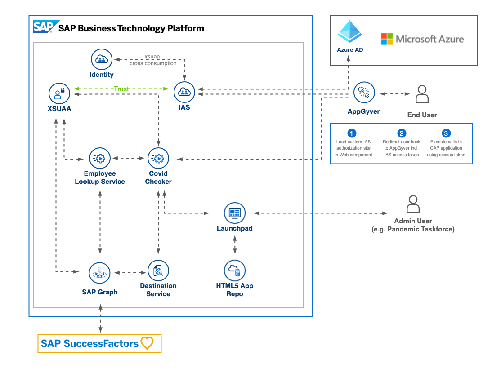

# Office Access - Covid Check app for SAP AppGyver

Description by Jim missing :-)

## Requirements
The required systems and components are:

- SAP BTP PAYGO (e.g. Free Tier) or CPEA contract
- SAP SuccessFactors system
- Covid vaccination certificate

Entitlements/Quota required in your SAP Business Technology Platform Account:

| Service                                       | Plan              | Number of instances |
| --------------------------------------------- | ----------------- | ------------------- |
| Cloud Foundry Memory                          |                   | 1GB                 |
| SAP Cloud Identity Services                   | application       | 1                   |
| SAP Graph                                     | standard          | 1                   |
| HTML5 Application Repository Service          | app-host          | 1                   |
| Destination Service                           | lite              | 2                   |
| SAP HANA Schemas & HDI Containers             | hdi-shared        | 1                   |
| SAP HANA Cloud                                | hana              | 1                   |
| Authorization and Trust Management Service    | application       | 1                   |

Subscriptions required in your SAP Business Technology Platform Account:

| Subscription                      | Plan                                                |
| --------------------------------- | --------------------------------------------------- |
| SAP AppGyver                      | standard                                            |
| SAP Business Application Studio   | standard-edition                                    |
| SAP Cloud Identity Services       | default (only if SAP IAS not available yet)         |
| Launchpad Service                 | standard                                            |

## Setup and Configuration

### [Step 1: Security setup](./tutorials/1_SecuritySetup/README.md) 

In this part of the tutorial you will learn how to setup the security related aspects of your scenario. The security setup will allow you secure access to your CAP REST endpoints using the so called PKCE flow. Therefore you will use SAP Identity Authentication Service and integrate it with your CAP service secured by SAP XSUAA. 

### [Step 2: Graph application](./tutorials/2_EmployeeLookupService/README.md)

In this part of the tutorial you will learn how to setup and configure app that queries SAP SuccessFactors using SAP BTP Graph service. This includes subscribing to the SAP Graph Service and creating a Destination for SAP SuccessFactors and configuring SAP Graph to query SAP SuccessFactors.

### [Step 3: Backend application](./tutorials/3_BackendApplication/README.md)

In this part of the tutorial you are going to deploy the main backend application built with the SAP Cloud Application Programming Model. This app validates and verifies the uploaded Covid Certificate and communicates with the earlier deployed EmployeeLookupService.

### [Step 4: AppGyver app](./tutorials/4_AppGyverApp/README.md)

In this part of the tutorial you will learn how to setup and configure your SAP AppGyver app including a secure access to your CAP REST endpoints. The SAP AppGyver app will allow you to upload or scan Covid vaccination or test certificates. The certificate will be checked in the CAP service and the validation result will be displayed and stored in the SAP AppGyver app. 

### [Step 5: Test cases](./tutorials/5_TestCases/README.md)
(Nani)

## Further Information

## Disclaimers:
- The author does not have a complete picture of all functional / non-functional requirements of the solution, e.g., legal requirements
- The concept is not meant to compete with the Microsoft PowerApps based solution built for the SAP Pandemic Taskforce.
- The concept tries to implement an easier workflow for the end-users of the solution (SAP employees, Pandemic Taskforce staff) than provided with the MS PowerApps based solution).

## Known Issues

None. 

## How to obtain support

[Create an issue](https://github.com/SAP-samples/covid-checker/issues) in this repository if you find a bug or have questions about the content.
 
For additional support, [ask a question in SAP Community](https://answers.sap.com/questions/ask.html).

## Contributing

Do you have ideas how to improve this scenario? Do you want to correct descriptions/artifacts of this repository? Don't hesitate to open a PR and we'll have a look at it. 

## License
Copyright (c) 2022 SAP SE or an SAP affiliate company. All rights reserved. This project is licensed under the Apache Software License, version 2.0 except as noted otherwise in the [LICENSE](LICENSES/Apache-2.0.txt) file.
