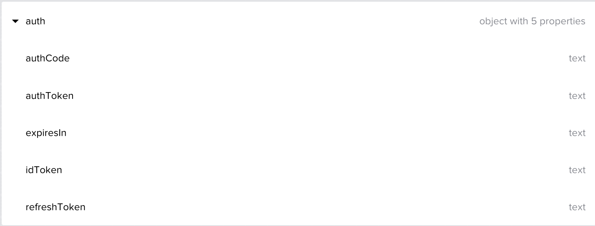
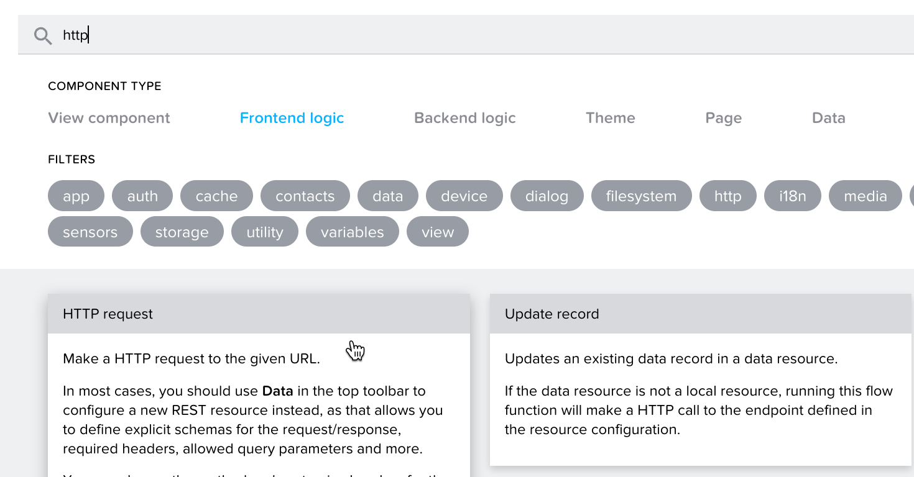
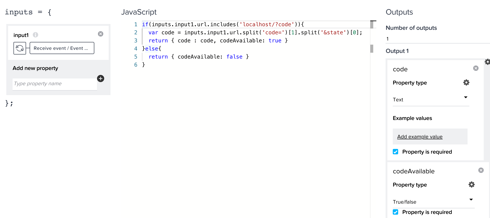
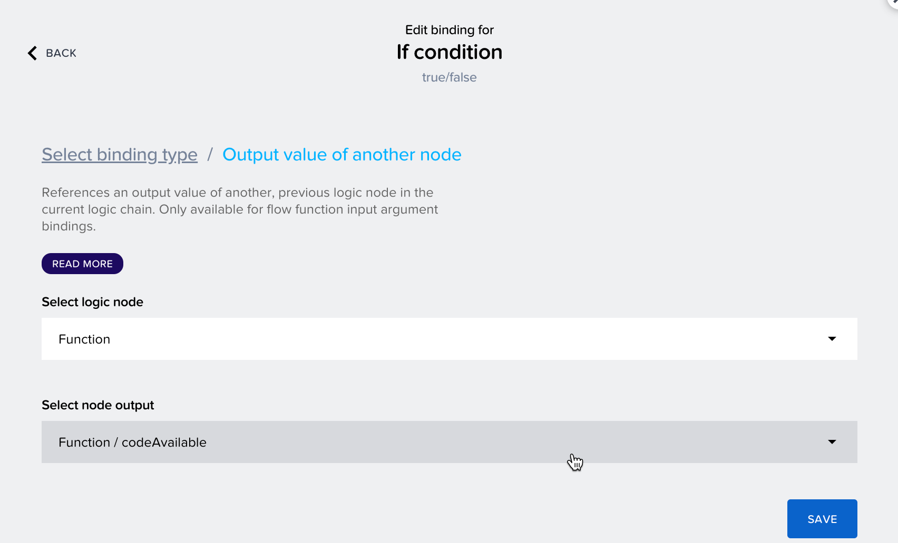

# SAP AppGyver configuration for OAuth 2.0 with PKCE flow

  Complete the following steps to create an SAP AppGyver mobile app that supports OAuth 2.0 with Proof Key for Code Exchange (PKCE)

## Initial app setup

  1. Run the LCNC Booster in BTP
  2. Access SAP AppGyver from LCNC application lobby and create a new app called demoApp
  3. Create a page called **OAuth**
  4. Select **AUTH** and enable authentication for the app
  5. Select **Direct third party authentication**
  6. Set **OAuth** to be the initial view
  7. Delete the login page
  8. Select the **OAuth** page
  9. Remove the default widgets and add a WebView component to the canvas. You will need to install it from the component market (note that WebView component only renders on mobile device)
     1. set URL property to: "https://**ias tenant**.accounts.ondemand.com/oauth2/authorize?client_id=**public client id**&scope=openid&code_challenge=**123**&code_challenge_method=S256&redirect_uri=http://localhost/&response_type=code"
     2. Update the **ias tenant** and **public client id** values with the ones from your environment
     3. The code challenge is only a placeholder and we will replace the whole URL property with an application variable in a later step
     4. Set layout of WebView to Width and Height > Advanced > Grow set to 1

       

     5. Set layout of WebView > Position > Align Self to Align this horizontally to the middle
  10. Select Page Layout element > Style > Check **Stretch to Viewport Height** and **Disable Scrolling**
  11. Expand Padding and clear it to make the component full screen
  12. Save your application

## OAuth configuration

  1. Click **Variables** and add an App Variable with the following properties:
     1.  Variable name: auth
     2.  Variable value type: Object
     3.  Add the following object properties, as below
         1.  authCode (text)
         2.  authToken (text)
         3.  expiresIn (text)
         4.  idToken (text)
         5.  refreshToken (text)

           
        
     4.  Save the app and go back to OAuth screen view
     5.  Select the WebView component and expand the logic modeling screen from the bottom
     6.  Install the HTTP request component from the flow function market

       

     7.  Configure each node as follows:

         1.  Add a JavaScript function and connect it to the Component onLocationChange event. Double-click it to open the JS editor and fill the required sections:

             1. input1: Output Value of another node > Receive event / Event Object
             2. ```
                 if(inputs.input1.url.includes('localhost/?code')){
                 var code = inputs.input1.url.split('code=')[1].split('&state')[0];
                 return { code : code, codeAvailable: true } 
                 }else{
                 return { codeAvailable: false } 
                 }
                ```
             3. Output 1 properties:
                1. code (text)
                2. codeAvailable (text)

             

             **The javascript above parses the response body returned by the authorize endpoint and adds the code and a boolean to the output of the node**

             4. Save and exit the JS editor 

         2.  Add an If condition > Output Value of another node > Function > codeAvailable

             

         3.  Set app variable:
             1.  Variable name > auth.authCode
             2.  Assigned value > Output value of another node > Function > code
         4.  HTTP Request:
             1.  URL > https://awhs090l4.accounts400.ondemand.com/oauth2/token
             2.  HTTP Method > POST
             3.  Headers > Custom List:
                 1.  Header: Content-Type  
                 2.  Value: application/x-www-form-urlencoded
                 3.  Header: Authorization
                 4.  Value: Basic ZjA2ZTA5NTYtMzdlNy00MThjLWE1YjItOGM1ODY0NDYxZDQwOlBZTFpDN0lZNHlyX0FFRUJMaFd2VHRSX11zZmlZag==
             4.  Request Body > Formula > {"grant_type": "authorization_code", "code": appVars.auth.authCode, "redirect_uri": "https://localhost", "client_id": "f06e0956-37e7-418c-a5b2-8c5864461d40"}
             5.  Request Body Type > x-www-form-urlencoded
         5.  Alert > Formula > ENCODE_JSON(outputs["HTTP request"].error)
         6.  Last 4 Set app variable components:
             1.  auth.authToken > Formula > STRING(outputs["HTTP request"].resBodyParsed.access_token)
             2.  auth.refreshToken > Formula > STRING(outputs["HTTP request"].resBodyParsed.refresh_token)
             3.  auth.idToken > Formula > STRING(outputs["HTTP request"].resBodyParsed.id_token)
             4.  auth.expiresIn > Formula > STRING(outputs["HTTP request"].resBodyParsed.expires_in)
     8.  Save the app before continuing