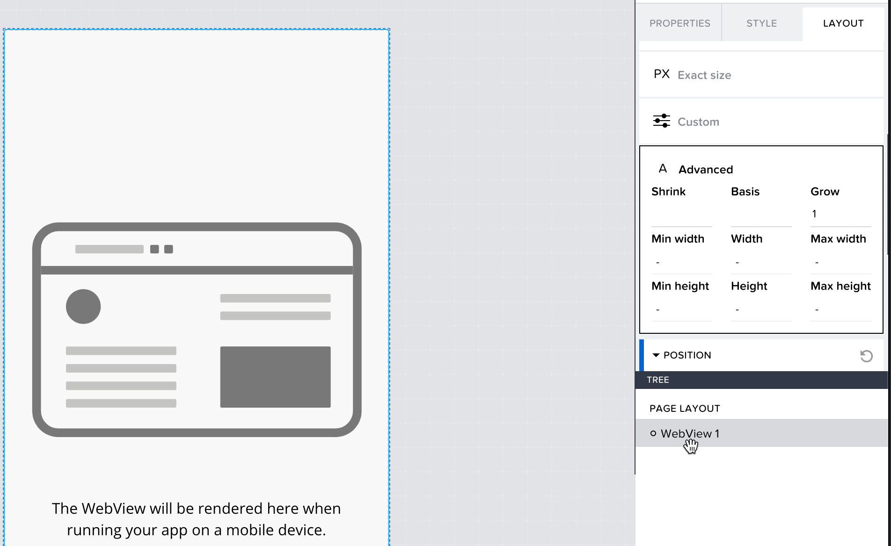

# SAP AppGyver configuration for OAuth 2.0 with PKCE flow

  Complete the following steps to create an SAP AppGyver mobile app that supports OAuth 2.0 with Proof Key for Code Exchange (PKCE)

## Initial app setup

  1. Run the LCNC Booster in BTP
  2. Access SAP AppGyver from LCNC application lobby and create a new app called demoApp
  3. Create a page called **OAuth**
  4. Select **AUTH** and enable authentication for the app
  5. Select **Direct third party authentication**
  6. Set **OAuth** to be the initial view
  7. Delete the login page
  8. Select the **OAuth** page
  9. Remove the default widgets and add a WebView component to the canvas. You will need to install it from the component market (note that WebView component only renders on mobile device)
     1. set URL property to: "https://<ias tenant>.accounts.ondemand.com/oauth2/authorize?client_id=<public client id>&scope=openid&code_challenge=123&code_challenge_method=S256&redirect_uri=http://localhost/&response_type=code"
     2. Update the **ias tenant** and **public client id** values with the ones from your environment
     3. The code challenge is only a placeholder and we will replace the whole URL property with an application variable in a later step
     4. Set layout of WebView to Width and Height > Advanced > Grow set to 1

       
       
     5. Set layout of WebView > Position > Align Self to Align this horizontally to the middle
  10. Select Page Layout element > Style > Check **Stretch to Viewport Height** and **Disable Scrolling**
  11. Expand Padding and clear it to make the component full screen