# Blog Post 

## Summary

In this blog (and the supporting GitHub repo), we will demonstrate how to:

1. Configure a SAP Identity Authentication Service (IAS) application for public client usage and enabled for cross-consuming SAP XSUAA services.
2.	Create an SAP AppGyver application that implements OAuth 2.0 Authorize and Token flows with PKCE, from an iOS device
3.	Manage access tokens and refresh tokens, and use them with a protected SAP Cloud Application Programming (CAP) service running in the SAP BTP, Cloud Foundry runtime


## SAP Identity Authentication & XSUAA Cross Consumption

### Usage of SAP Identity Authentication

In this chapter you will learn why we decided to use the SAP Identity Authentication Service in our scenario, whereas we could have done things with XSUAA only. 

SAP XSUAA is an SAP specific variant of the Cloud Foundry User Account and Authentication (UAA) Server. Whereas XSUAA fulfills similar tasks as SAP IAS when it comes to authentication a user and providing required access tokens, for our scenario there is one major deficit of XSUAA. Whereas the Cloud Foundry UAA implementation supports the so called PKCE approach for authentication public clients, the XSUAA fork doesn’t. 


What is PKCE and why is it important for this use case? The so-called Proof Key for Code Exchange (PKCE) authentication approach has been developed for public clients (like mobile apps), which are not capable or supposed to store the Client Secret on a user’s device. It is a variant of the Authorization Code Flow provided by OpenID Connect, which allows a secure authentication mechanism without the requirement to provide the client secret when calling the token endpoint of the authentication service. 

The PKCE approach follows RFC7636 ([click here](https://datatracker.ietf.org/doc/html/rfc7636)) and there is bunch of very detailed information available across the world-wide-web on this flow. Check out the oauth.net page ([click here](https://oauth.net/2/pkce/)) to learn more about this topic and try out their nice playground ([click here](https://www.oauth.com/playground/authorization-code-with-pkce.html)) to get a much better understanding of the required steps. 

As explained in detail in the provided links, the general idea of the PKCE approach is that the client generates a random string and sends it to the to the Authorization Server as a (usually SHA256 encrypted) so-called **code_challenge**. The authorization server keeps track of this challenge and returns an authorization code to the client. 

When the client now tries to obtain an access token using the authorization code, he has to provide the random string once again as a so-called code_verifier. The authorization server no compares the **code_verifier** against the stored code_challenge. Only if both values match, it will issue an access token to the client. 

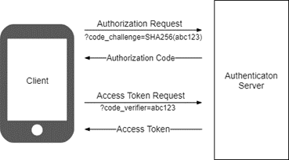

Whereas the Authorization Code Flow for non-public clients requires the Client Secret when requesting the Access Token from the authentication server, in the PKCE approach this is not required. This mitigates to risk of compromising the Client Secret and all severe consequences of such a critical security issue! 

Whereas private clients like e.g., a web application are capable of storing the Client Secret in a secure manner, an attacker who is able to decompile an app running on a public client may have access to your secret within minutes. This is why over the last years, the PKCE flow has become the de-facto standard across the industry when it comes to public client authentication. 

As said, the SAP XSUAA service does not support the usage of PKCE so for a public client only the standard Authorization Code Flow including Client Secret can be used. This is why we decided to use the capabilities of SAP IAS, which is supporting this kind of flow. You might ask yourself now – “Sounds reasonable, but how do I get access to services in my SAP BTP environment then, which are secured by XSUAA and not IAS?”. That’s a valid question which we will cover in the following chapter. 

## SAP IAS - SAP XSUAA cross consumption

While most of the existing scenarios in the SAP environment rely on user authentication against SAP XSUAA and using SAP IAS as IdP (if desired), this scenario is different. As explained, we cannot authenticate against XSUAA in this scenario because of the missing PKCE feature but the user needs to authenticate against IAS. As a consequence, he will not receive an access token issued by XSUAA but issued by IAS this time. So how can this token now be used to call services like an SAP CAP application, which is tightly integrated with XSUAA but not with IAS? 

For scenarios like this, a very powerful feature of **cross consumption** exists. If few requirements are fulfilled, it is possible validate tokens issued by IAS in an XSUAA context. 

1. A trust between XSUAA and IAS needs to be established (click here). Use the OpenID Connect approach for this instead of manually exchanging SAML metadata.  

2.	An instance of the so-called Cloud Identity Services (identity) needs to be created in the respective SAP BTP subaccount, including a property for XSUAA cross consumption. 

You will learn in the following steps, how this can be implemented in your own SAP BTP subaccount and your SAP Identity Authentication instance. 

### SAP XSUAA - SAP Identity Authentication trust

1. Make sure a trust between you SAP BTP Subaccount (XSUAA) and your SAP Identity Authentication instance has been set up. Make sure you use the **Establish Trust** feature for this purpose instead of the manual configuration!

    > **Hint –** This will only work if the customer ID associate with your SAP BTP Global account and your SAP Identity Authentication service match! More details on this step can be found in SAP Help (click here or click here).

    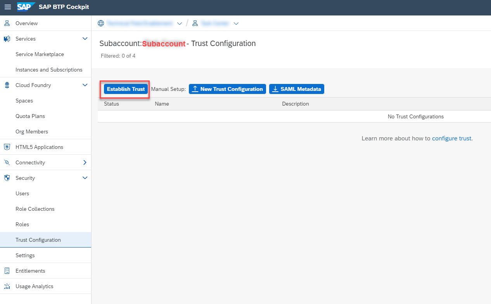

2. Select the SAP Identity Authentication instance which you want to connect to your current SAP BTP Subaccount. After a few seconds, trust should be established successfully. 

    >**Hint –** In case you cannot see your existing SAP IAS instance here, please open a support ticket to the component BC-IAM-IDS to make sure your instance is mapped to your SAP BTP environment. 

    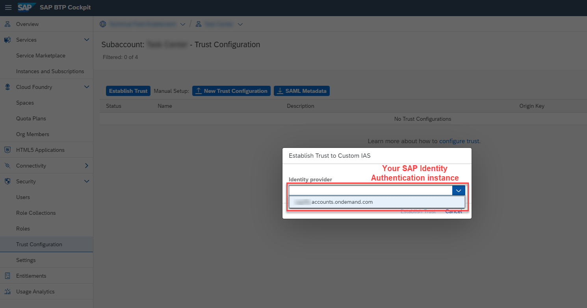


3. You should now see a new custom OpenID Connect trust between your SAP BTP Subaccount and your custom SAP IAS instance with the Origin Key **sap.custom**. 

    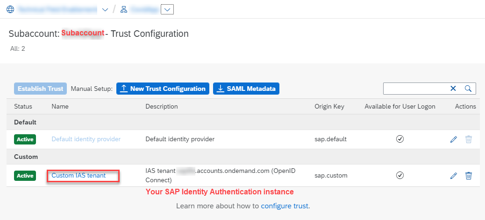

4. Login as an administrator to your SAP Identity Authentication Service and open the Applications overview. You should now see a new Bundled Application with following name syntax XSUAA-`<Subaccount Name>`. This application was created when you set up the trust between your SAP BTP Subaccount XSUAA environment and SAP Identity Authentication service.

    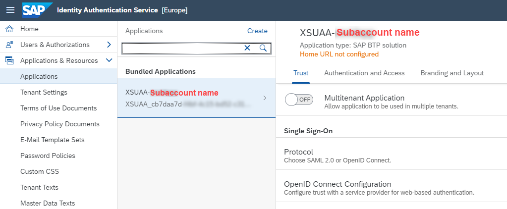


5. You can check the details of this OpenID Connect Configuration in the respective sub-menu. Here you can see the redirect URLs leading back to your SAP BTP environment.

    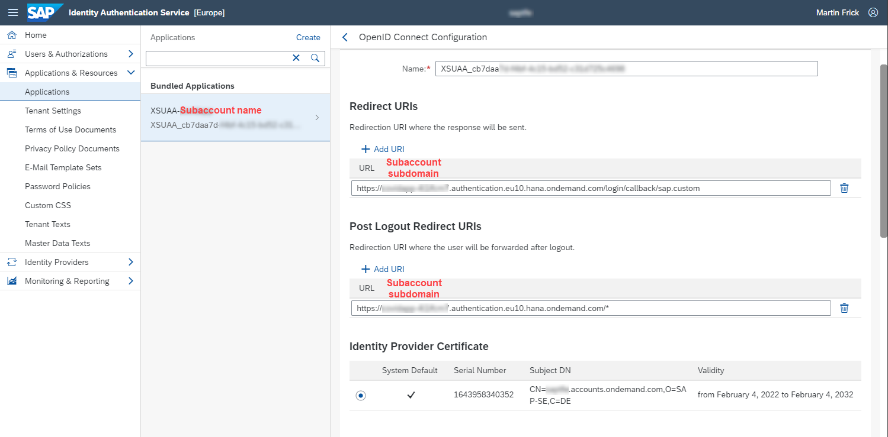

    Well done, you’ve set up the required trust between your SAP BTP XSUAA environment and SAP Identity Authentication. In the next step you can make use of this trust and create a new application configuration in SAP Identity Authentication using a dedicated SAP BTP service broker.

### SAP Cloud Identity Services instance

1. Go to the Instances and Subscriptions area of your SAP BTP Subaccount and create a new service instance of type Cloud Identity Services (identity). This service instance will create the corresponding application configuration in SAP IAS. Select the **application** plan and give your service instance a speaking name. You can e.g., name it **demoApp-ias**. Then click on **Next**.

    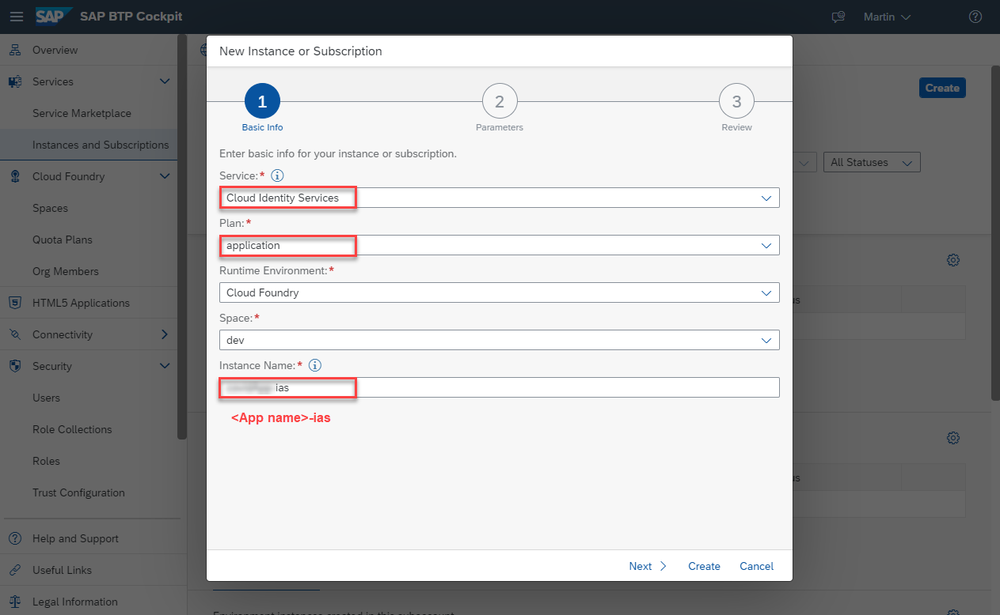

2. Provide the required configurations for your instance, which the service broker will use to create the corresponding application in SAP IAS. You can use the provided JSON file (see below) for the current sample use-case. Once configured, please click on **Create**. 

    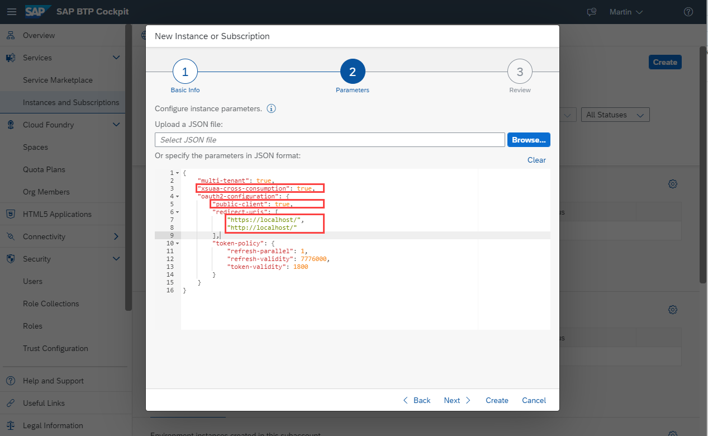


    ```
    {
        "multi-tenant": true,
        "xsuaa-cross-consumption": true,
        "oauth2-configuration": {
            "public-client": true,
            "redirect-uris": [
                "https://localhost/",
                "http://localhost/"
            ],
            "token-policy": {
                "refresh-parallel": 1,
                "refresh-validity": 7776000,
                "token-validity": 1800
            }
        }
    }
    ```

    Of special importance are the following parameters. For the other parameters please check the official documentation of the SAP Cloud Identity service if not self-explanatory (like validity of access and refresh tokens)

    - **xsuaa-cross-consumption:**  true
    This will add the Client ID of the XSUAA application registration (which was created in IAS when you configured the trust between SAP BTP XSUAA and SAP IAS) to the Audience of the token issued by the new application registration created by the service broker. This setting is essential, as it will allow a token exchange from a token issued by SAP IAS to a corresponding token issued by SAP XSUAA. 

    - **public-client** : true
    This will make your new SAP IAS application registration used by AppGyver a public application. As a consequence, you can use the PKCE flow but no more Client Secrets can be created for this application anymore. 

    - **redirect-urls** : https://localhost/, http://localhost/
    Within SAP AppGyver we will extract the authorization code from the resulting redirect URL after the user has successfully authenticated against the SAP IAS application. For this process we use a WebComponent within SAP AppGyver and add a change event for the URL value of this component. Once the WebComponent URL changes to **localhost**, we can extract the required authorization code. More details on this approach will follow later or can be found in the following SAP AppGyver forum post (click here).

      >**Hint -** In case you want to authenticate a user in the native mobile browser instead of a WebComponent (which is also possible), a redirect to the AppGyver app would be required (click here for more details). As SAP IAS can only redirect to **http** or **https** URL prefixes, this makes testing the app impossible. Whereas for a standalone build, a custom URL scheme (e.g., iOS click here) for redirects could be used, the SAPAppGyver app relies on the sapappgyverrn:// URL prefix for redirects.

3. It will take a while but once the service broker has finished its job, you can switch back to the SAP Identity Authentication service. Here you will see a new application registration now, which was created based on your JSON configuration and is named like the corresponding SAP BTP service instance.

    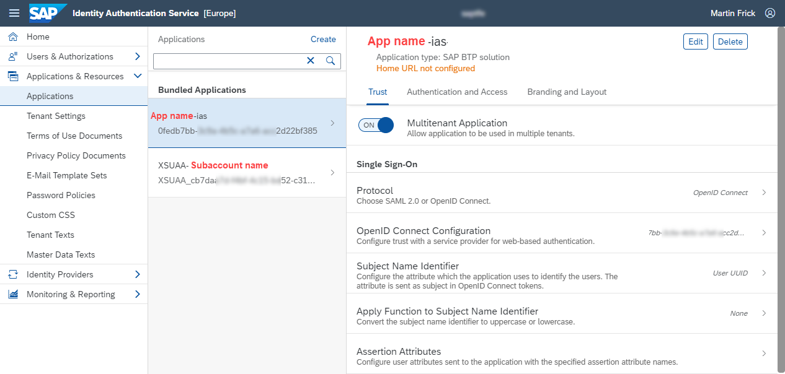

4. Select your new application registration and check out the settings. You can for example open the **Client ID, Secrets and Certificates** configuration. Here you will see that your application is serving public clients. This allows the usage of the PKCE flow for authentication. 

    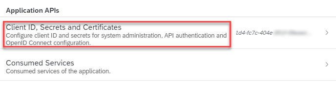

    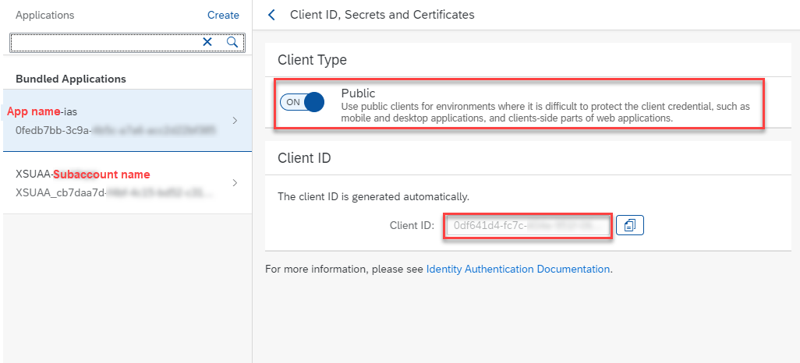

5. Another interesting aspect to check is the XSUAA cross consumption capability. You can see this in the **Consumed Services** configuration. You can see that your new application registration “consumes” the application registration which was created in SAP IAS when you set up the trust between SAP IAS and SAP BTP XSUAA environment. 

    >**Hint –** As already explained, this will add the Client Id of your XSUAA application registration to the Audience of your future access tokens issued for your public SAP AppGyver application registration. As SAP BTP XSUAA is linked to the same SAP IAS instance (OIDC provider (IDP)) which will be the issuer of the token, this allows a token exchange from an SAP IAS token to an SAP XSUAA token. Therefore, the JWT Bearer Token Grant (click here) flow is used which follows RFC7523 (click here).

    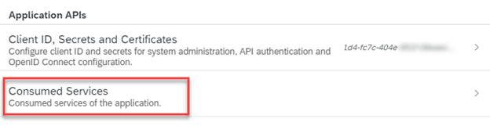

    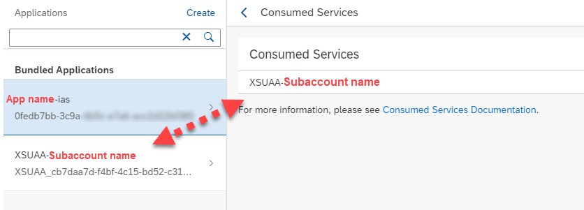

### SAP XSUAA service instance

1. That’s it, you’re done! You can now authenticate against SAP IAS and use the issued token to access SAP BTP services protected by SAP XSUAA. We will test the token exchange in the next step. Before doing so, you need to create an SAP XSUAA service instance first. Make sure you choose **application** as plan. You can e.g., name it **demoApp-uaa** 

    > If you choose a different name please also update the CAP project before deployment!

    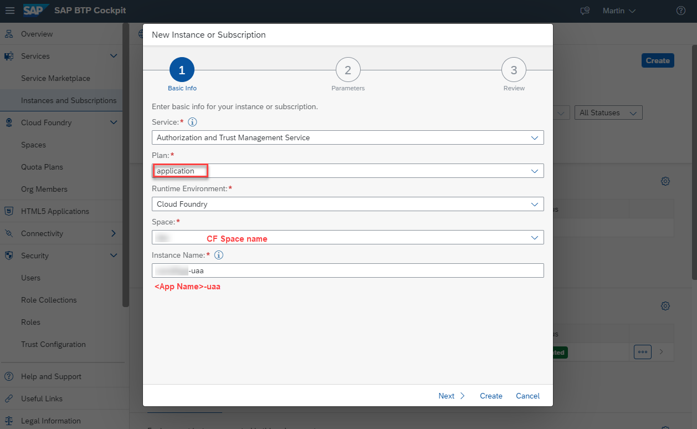

2. This SAP XSUAA service instance will be bound to your SAP CAP application later and allows your application to evaluate the JWT token which is issued by XSUAA in exchange to the SAP IAS id_token. 

    > **Hint –** You will not notice the exchange taking place. This feature is already integrated in to e.g.,  the **@sap/xssec** Node.js package which will notice if the token is coming from SAP IAS or SAP XSUAA and trigger an exchange if necessary. 

    Provide the following JSON file as configuration settings for this XSUAA instance. This will create an admin role for your application. Update the xsappname if required.

    ```
    {
      "xsappname": "<App name e.g., demoApp>",
      "tenant-mode": "dedicated",
      "scopes": [{
        "name": "$XSAPPNAME.admin",
        "description": "admin"
      }],
      "attributes": [],
      "role-templates": [{
        "name": "admin",
        "scope-references": [
          "$XSAPPNAME.admin"
        ],
        "attribute-references": []
      }]
    }
    ```

3. Once the SAP XSUAA instance is created, create a new service key for testing purposes. You can e.g., name it **demoApp-uaa-key**. 

    >This service key is only used for testing purposes. During deployment, a regular binding will be created.

    

### SAP IAS user group and role collection mapping

1. Create a new User Group in SAP IAS and assign the application users to that group. You can e.g, call the user group **DemoApp**. 

    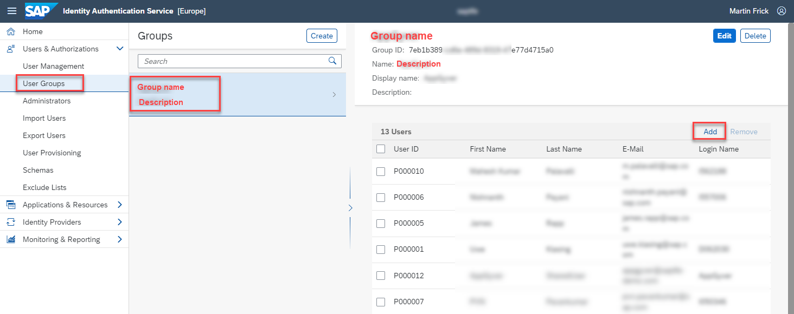


2. On the SAP BTP side please create a new role role collection (e.g., **DemoApp**) containing the **admin** role which was which was created when setting up your SAP XSUAA service instance. Assign the name of the user group injected via the IAS token (e.g., **DemoApp**) to that role collection, so group members are assigned the relevant XSUAA role collection automatically. 

    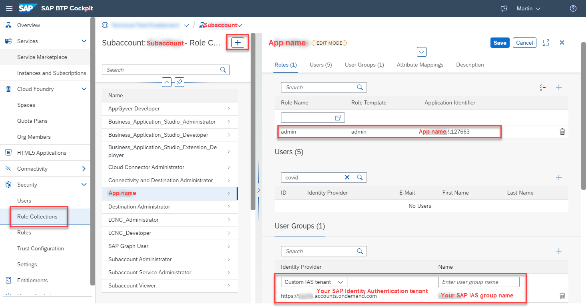


## SAP IAS – SAP XSUAA token exchange

The provided GitHub repository contains a folder called http, which provides some sample request to check your configuration before building things in AppGyver. Open the authTest.http file in SAP Business Application Studio or Visual Studio Code (plugin required) to start the tests in your own environment.


1. Update the variables in the authTest.http file. 

    - **iasHostname** : Your SAP IAS hostname 
    - **xsuaaHostname** :	The hostname of your SAP BTP subaccount XSUAA instance
    - **iasTokenEndpoint** : Most probably /oauth2/token
    - **capiasClientId** : The SAP IAS Client ID of your public application registration
    - **codeChallenge** : Use the provided code challenge or get a PKCE code challenge using available online tools (for testing purposes only!)
    - **codeVerifier** : Use the provided code verifier or get a PKCE code verifier which fits your challenge using available online tools (for testing purposes only!)
    - **btpXsuaaClient** : Use the Client Id of your XSUAA instance service key
    - **btpXsuaaSecret** : Use the Client Secret of your XSUAA instance service key

2. Call the authorization endpoint of your SAP Identity Authentication instance in your local browser, after updating the below URL to your custom settings. 

    
    `<iasHostname>`/oauth2/authorize?client_id=`<capiasClientId>`&scope=openid&code_challenge=`<codeChallenge>`&code_challenge_method=S256&redirect_uri=http://localhost/&response_type=code&state=state

    >**Hint –** We will not cover topics like the state or nonce parameter in this blog post. Please check if you need these parameters for additional security in your environment!

3. After a successful login using your SAP IAS user credentials, you will be forwarded to a localhost URL, which contains the required authorization code. Copy this code. 

    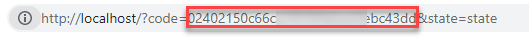

4. Go back to your authTest.http file and paste the code which you just copied into the first request named **getIasToken** as value for the **code** parameter. Please be aware this code is only valid for a few minutes! The rest of the parameters remains constant or is filled via variables. Send the POST request to obtain an id_token and access_token from SAP IAS. 

5. Feel free to decode the **id_token** (e.g., using an online tool npm package), which will result in something similar to this. You can see, the relevant parameters for the upcoming token exchange like iss (issuer) and aud (audience) which contains the Client Id of your XSUAA application registration. This Id is also stored in your XSUAA server as relying party.

    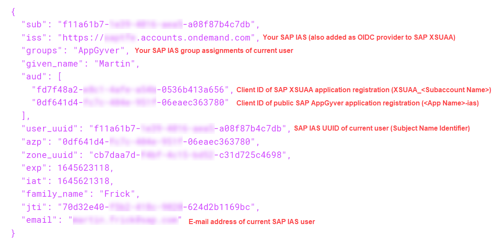

6. Now you can trigger the token exchange of this id_token to an JWT token issued by SAP XSUAA by sending the next request called **doXsuaaTokenExchange**. The parameters are either static or filled by the results of your previous request response (like the id_token). 

7. Decoding the resulting access_token issued by SAP XSUAA will result in something similar to the following. Without going into the details, you can see that the token is now issued by XSUAA and contains additional XSUAA specific information like attributes or role collections based on the role collection mapping which we conducted in the previous chapter. 

    >**Hint –** As already said, this exchange/validation is conducted automatically by the @sap/xssec package once your CAP endpoints are called using an SAP IAS token. 

    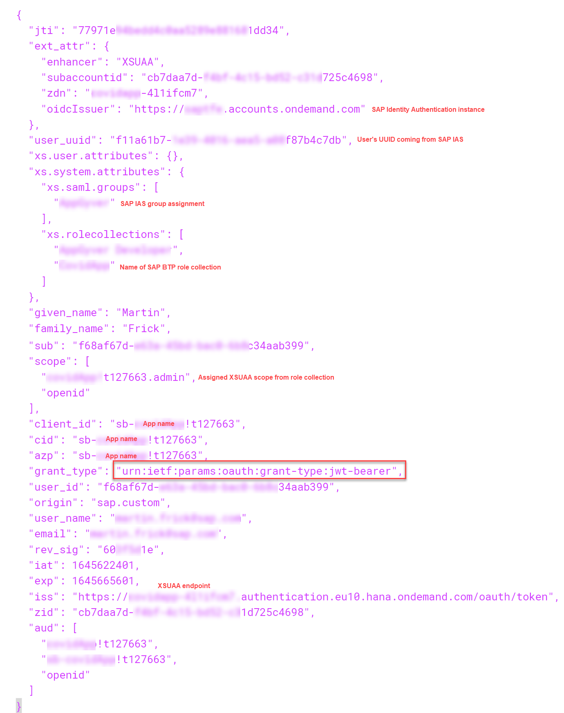


## SAP AppGyver configuration for OAuth 2.0 with PKCE flow

  Complete the following steps to create an SAP AppGyver mobile app that supports OAuth 2.0 with Proof Key for Code Exchange (PKCE)

### Initial app setup

  1. Run the LCNC Booster in BTP
  2. Access SAP AppGyver from LCNC application lobby and create a new app called demoApp
  3. Create a page called **OAuth**
  4. Select **AUTH** and enable authentication for the app
  5. Select **Direct third party authentication**
  6. Set **OAuth** to be the initial view
  7. Delete the login page
  8. Select the **OAuth** page
  9. Remove the default widgets and add a WebView component to the canvas. You will need to install it from the component market (note that WebView component only renders on mobile device)
     1. set URL property to: "https://**ias tenant**.accounts.ondemand.com/oauth2/authorize?client_id=**public client id**&scope=openid&code_challenge=**123**&code_challenge_method=S256&redirect_uri=http://localhost/&response_type=code"
     2. Update the **ias tenant** and **public client id** values with the ones from your environment
     3. The code challenge is only a placeholder and we will replace the whole URL property with an application variable in a later step
     4. Set layout of WebView to Width and Height > Advanced > Grow set to 1

       

     5. Set layout of WebView > Position > Align Self to Align this horizontally to the middle
  10. Select Page Layout element > Style > Check **Stretch to Viewport Height** and **Disable Scrolling**
  11. Expand Padding and clear it to make the component full screen
  12. Save your application

## OAuth configuration

  1. Click **Variables** and add an App Variable with the following properties:
     1.  Variable name: auth
     2.  Variable value type: Object
     3.  Add the following object properties, as below
         1.  authCode (text)
         2.  authToken (text)
         3.  expiresIn (text)
         4.  idToken (text)
         5.  refreshToken (text)

       
        
  2.  Add 2 Page variables to hold the PKCE relevant properties
      1.  auth_with_pkce (web URL)
      2.  code_verifier (text)

       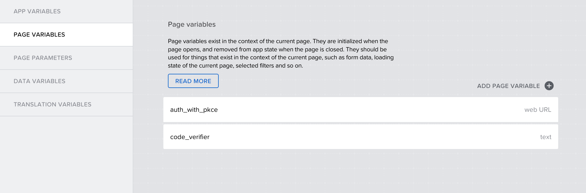

  3.  Save the application and click back to the **VIEW** screen
  4.  Update the URL field of the WebView component to the newly created **auth_with_pkce** page variable

       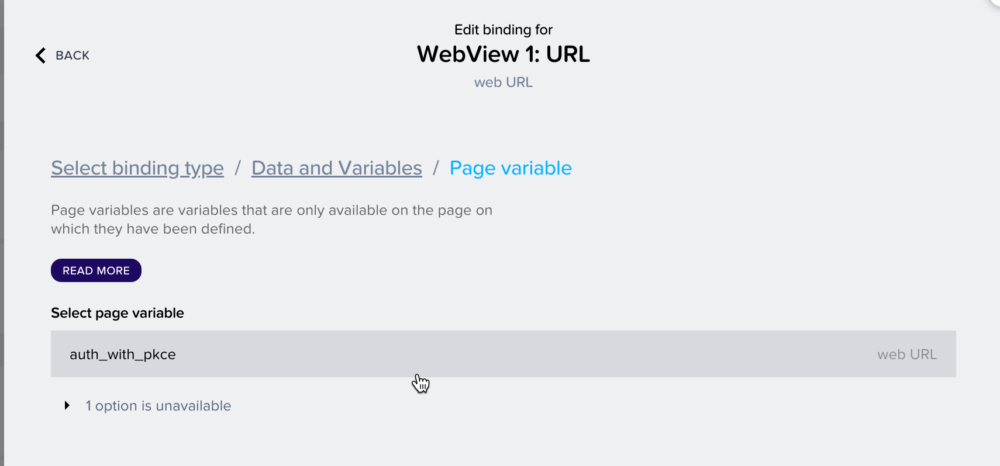

  5.  Select the WebView component and expand the logic modeling screen from the bottom
  6.  Install the HTTP request component from the flow function market

       
 
  7.  Configure each node as follows:
      1.  Add a JavaScript function and connect it to the Component onLocationChange event. Double-click it to open the JS editor and fill the required sections:
          1.  input1: Output Value of another node > Receive event / Event Object
          2.  ```
              if(inputs.input1.url.includes('localhost/?code')){
              var code = inputs.input1.url.split('code=')[1].split('&state')[0];
              return { code : code, codeAvailable: true } 
              }else{
              return { codeAvailable: false } 
              }
              ```
          3. Output 1 properties:
             1. code (text)
             2. codeAvailable (text)

             

      **The javascript above parses the response body returned by the authorize endpoint and adds the code and a boolean to the output of the node**

      1.  Add an If condition and connect it to the output node of the JS > Output Value of another node > Function > codeAvailable

        
      2.  Add a **Set app variable** function, connect it to the 1st node of the if condition, which is triggered on a truthy result, and configure it:
      3.  Variable name > auth.authCode
      4.  Assigned value > Output value of another node > Function > code

      5.  Add an HTTP Request and connect it to the output node of the Set app variable function:
          1.  URL > "https://**ias tenant**.accounts.ondemand.com/oauth2/token?grant_type=authorization_code&client_id=**public client id**&code="+outputs["Function"].code+"&redirect_uri=http://localhost/&code_verifier="+pageVars.code_verifier
          2.  HTTP Method > POST
          3.  Headers > Custom List:
              1.  Header: Content-Type  
              2.  Value: application/x-www-form-urlencoded
          4.  Request Body Type > x-www-form-urlencoded

              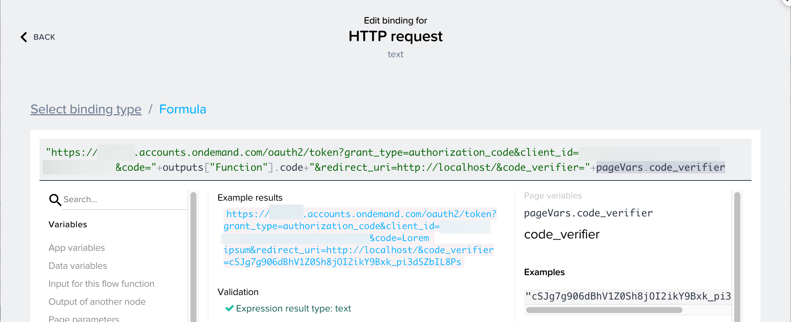

      6.  Add a Dismiss initial view component and connect it to the same output from Set app variable
      7.  Add another Set app variable component, connect it to the 1st output from the HTTP request, and clone it 3 times. Set the variable names and assigned values as below:
          1.  auth.authToken > Formula > STRING(outputs["HTTP request"].resBodyParsed.access_token)
          2.  auth.refreshToken > Formula > STRING(outputs["HTTP request"].resBodyParsed.refresh_token)
          3.  auth.idToken > Formula > STRING(outputs["HTTP request"].resBodyParsed.id_token)
          4.  auth.expiresIn > Formula > STRING(outputs["HTTP request"].resBodyParsed.expires_in)
  8.  Save the app before continuing and check that your logic flow looks something like this:
      
      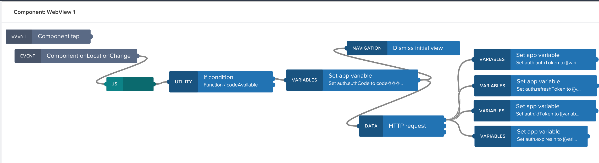

## PKCE implementation

  It is now necessary to add logic at the page layout level that generates the code challenge and verifier needed for the PKCE flow. Because the JavaScript runs in the local device browser, it doesn't meet the criteria for a straightforward implementation of crypto.subtle. You can find polyfill JavaScript in this repository that will enable the implementation.

1.  Select the **Page Layout** component from the tree
2.  Expand the logic modeler, add a JavaScript component to the canvas, and connect it to the Page mounted event
3.  Double-click the JS component and paste the code from [pkceCoding.js](./pkceCoding.js) into the JavaScript pane
4.  Add a property called **verifier** and another called **challenge** to Output 1. Set the value types to Text and click update.

    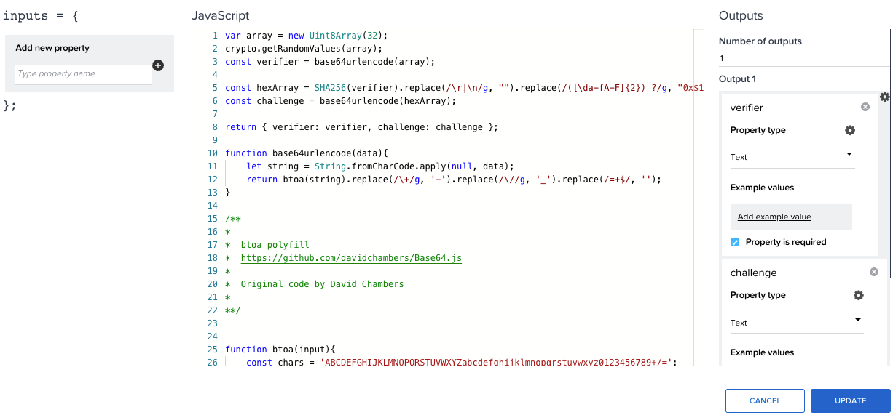

5. Add a Set page variable component and connect it to the output of the JS node
6. Set the variable name to code_verifier and assign the value **Function / verifier**

    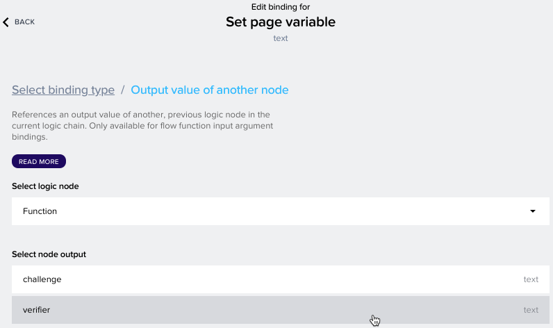

7. Add another Set page variable component and connect it to the JS output node as well
8. Set the variable name to auth_with_pkce and set the value to a formula. Use the following dynamic URL syntax, disregard any validation errors related to web-url types and save:

    "https://**ias tenant**.accounts.ondemand.com/oauth2/authorize?client_id=**public client id**&scope=openid&code_challenge="+outputs["Function"].challenge+"&code_challenge_method=S256&redirect_uri=http://localhost/&response_type=code"

9. Your flow logic should look similar to the image below. Save the application before proceeding.

    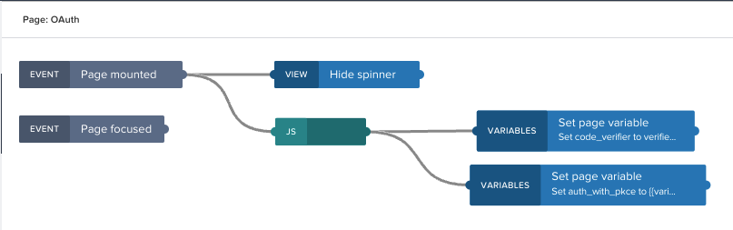

## Add pages to display OAuth response and test

  This is the perfect time to test the logic that you have implemented in the previous steps. First, let's add new AppGyver pages and enable navigation, so that we can see the OAuth response and corresponding properties.

1. Click the page name **OAuth** in the top left corner under the application name. Add 2 new pages, Start and Token. Save the application.
2. Select Navigation, add 2 items, and set the Label and Page values accordingly. Pick any icons that suit you. Make sure navigation is enabled, as below.

    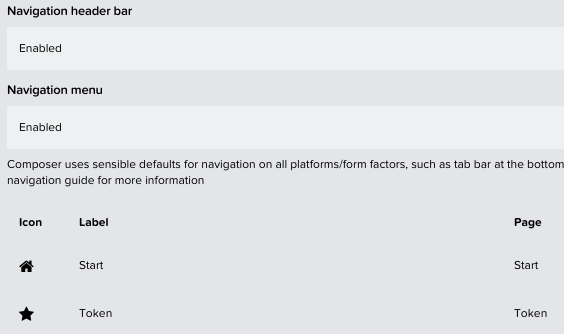

3. Access the Start page, update the title, and add some text fields to hold the authentication code and access token values. Set the value rows to auth.authCode and auth.authToken respectively.

    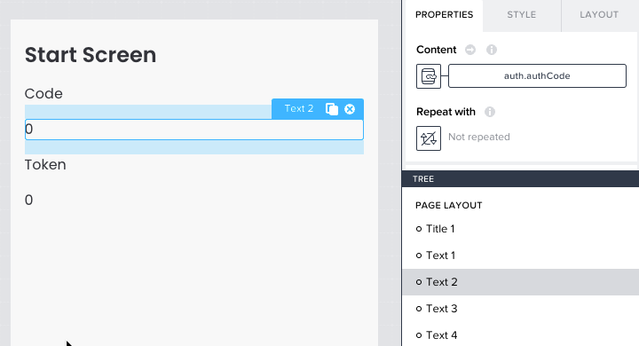

4. Access the Token page, update the title, and add some text fields to hold the remaining properties, refresh token, expires in, and id token.

    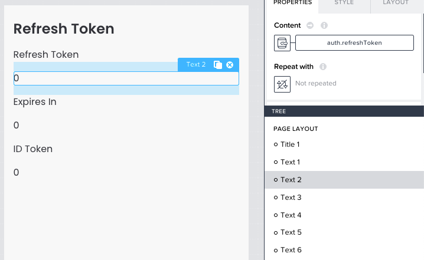

5. Save the app if you haven't recently and select the launch option. You will need to install the SAP AppGyver app from the Apple App Store to take the next steps.
6. Click reveal QR code under Mobile Apps and scan it from the SAP AppGyver app
7. Enter your logon credentials for the IAS tenant. The process should look something like the below quick demo.

    