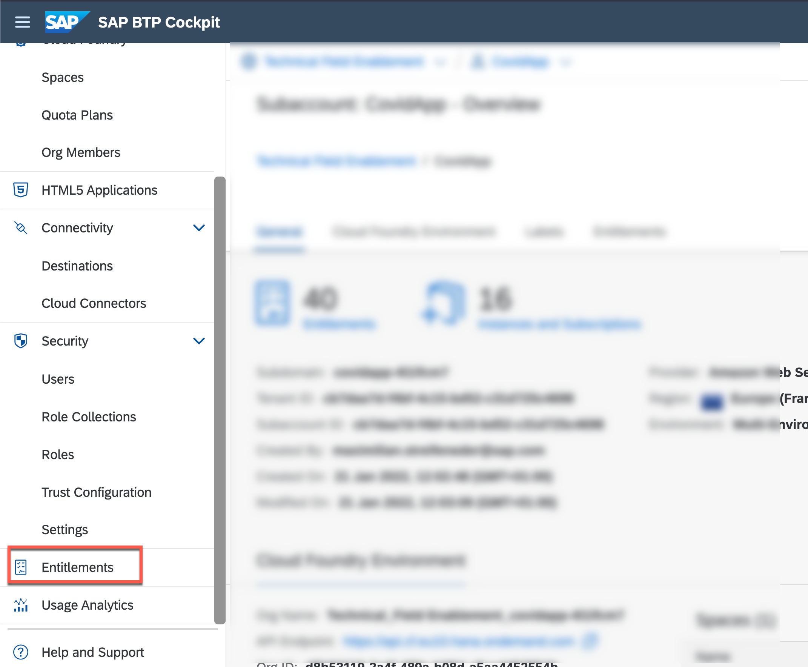
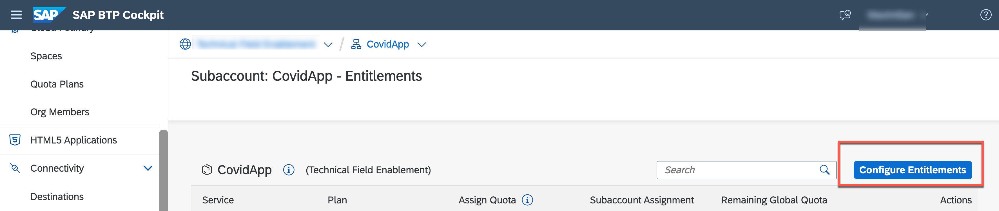

# General setup 

## Set Entitlements

1. Go to the [SAP BTP Cockpit](https://cockpit.eu10.hana.ondemand.com/) and select the SAP Business Technology Platform (BTP) subaccount you want to use for this scenario. 

2. Navigate to **Entitlements** and select **Configure Entitlements**. 

3. Make sure you have the following Entitlements set: 

| Service  	| Plan  	|  Quota	|
|---	|---	|---	|	
|  SAP HANA Cloud 	|  hana 	|   1	| 
|  SAP HANA Schemas & HDI Containers 	| hdi-shared  	|   1	| 
|  SAP AppGyver	| standard (Application)   	|   1	|   	
|  SAP Graph	| standard   	|   1	| 
|  Authorization and Trust Management Service (xsuaa) 	| application   	|   1	| 
|  Launchpad Service	| standard (Application)  	|   1	| 
|  SAP Business Application Studio	| standard-edition  	|   1	| 
|  Destination Service	| lite  	|   1	| 
|  Cloud Identity Services	| application  	|   1	| 
|  HTML5 Application Repository Service	| app-host  	|   1	| 
|  HTML5 Application Repository Service	| app-runtime  	|   1	| 

4. **Save your changes**. 

