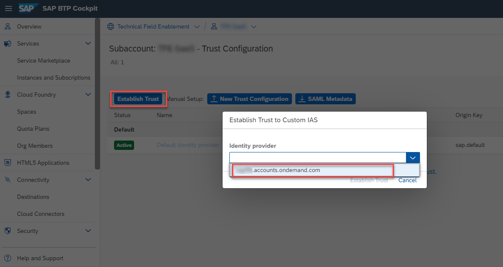
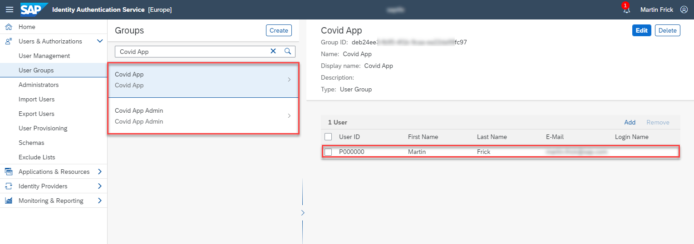
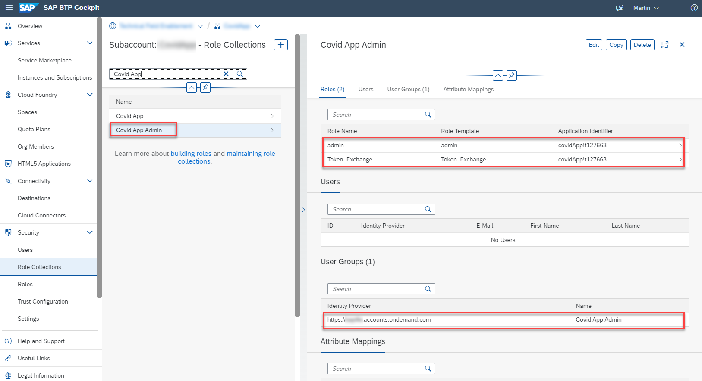
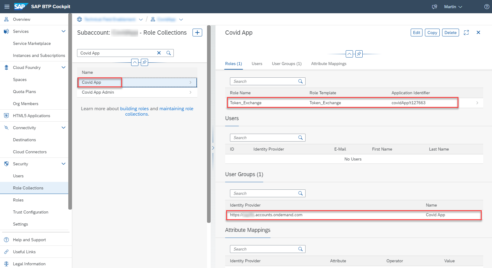

# Security Setup

## Introduction

Learn how to setup the security related services for your application. As the respective services will be part of the actual CAP application and the SAP AppGyver app, they need to be configured before you start the acutal development of your other components. 

For this part of the tutorial we recommend studying the following blog post and corresponding GitHub repository first, which will be linked and reused throughout the next steps. 

https://blogs.sap.com/2022/03/22/sap-appgyver-and-proof-key-for-code-exchange-pkce-or-striving-for-enterprise-grade-security-in-sap-low-code-applications/

The blog post covers the topic of **Proof Key for Code Exchange (PKCE)** which is an OAuth authorization grant type relevant for mobile clients not being capable of storing a client secret for authentication purposes. 

Instead of using SAP XSUAA for user authentication, in this scenario the SAP Identity Authentication Service (SAP IAS)  will be used. Based on the convenient XSUAA cross-consumption feature, the respective OAuth token can be be used to seamlessly access your SAP XSUAA based application like CAP apps. 

Therefore, in the following you will first create a new SAP Identity Authentication service instance (if not available yet). Then you will need to setup the trust between your SAP BTP XSUAA subaccount instance and your SAP Identity Authentication instance. 

In the next step you can create a new application registration in SAP IAS and a corresponding SAP XSUAA service instance providing the required roles on the SAP BTP side. Finally you will map the SAP IAS group assignments to SAP BTP XSUAA role collections before testing the actual token exchange feature between the two authentication tools. 


---

## Setup an SAP Identity Authentication Service tenant

>If you don't have an existing SAP Identity Authentication Service tenant in your landscape, please follow the steps in the official [SAP Help](https://help.sap.com/docs/IDENTITY_AUTHENTICATION/6d6d63354d1242d185ab4830fc04feb1/93160ebd2dcb40e98aadcbb9a970f2b9.html?locale=en-US#getting-a-tenant) guide to enable it for this scenario. You can check in the **Trust Configuration** of your SAP BTP subaccount if there is an SAP Identity Authentication tenant available for your customer ID and establish the required trust (if not yet done already).
>

A default instance of **SAP Identity Services** (Identity Authentication/Identity Provisioning) can be used for free by every **SAP BTP PAYGO** or **CPEA** customer given a few conditions. This includes developers signing up for **SAP BTP Free Tier** PAYGO scenarios. The free usage covers all setups in which access to or between official SAP solutions (on-premise and cloud) and applications provisioned on SAP BTP is authenticated. In case of authentication requirements to **3rd party applications** (not deployed on SAP BTP), an **additional license** is required, where a payment is based on number of logins. Please familiarize yourself with the official and latest "SAP Business Technology Platform service description guide" to find more details on free usage allowance. The service description guide is the **legal and binding document** when it comes to licensing questions. 
 
Your free default instances (**SAP IAS** and **SAP IPS**) can either be subscribed via the SAP BTP Cockpit (**"SAP Identity Services"**) or might already be pre-provisioned in your landscape by using an existing SAP cloud solution like SAP SuccessFactors. You can find more details on solutions including SAP Identity Services in the following documentation ([click here](https://help.sap.com/docs/IDENTITY_AUTHENTICATION/6d6d63354d1242d185ab4830fc04feb1/93160ebd2dcb40e98aadcbb9a970f2b9.html?locale=en-US)). A PAYGO or CPEA customer (including SAP BTP Free Tier PAYGO scenarios) can only have **one free default instance** (and one test-instance) per customer landscape. The limitation is based on the respective customer ID. An additional free "test-tenant" will be provided on request only. Any further additional (paid) tenants can be licensed if required.  
 
Samples for **free usage scenarios**:
- Using SAP IAS to authenticate against SAP BTP (Cockpit or apps) with SAP IAS acting as IdP
- Using SAP IAS to authenticate against SaaS or custom applications deployed to SAP BTP 
- Using SAP IAS to authenticate against an SAP cloud solution like SAP SuccessFactors
- Using SAP IAS to authenticate against an SAP on-premise solution like SAP S/4HANA
- Using SAP IPS for user provisioning to SAP BTP or a SAP cloud solutions like SAP SuccessFactors
- Using SPA IPS for user provisioning to SAP on-premise solutions like SAP S/4HANA

---

## SAP XSUAA - SAP Identity Authentication trust

To setup the required trust between the SAP XSUAA instance of your SAP BTP subaccount and your SAP Identity Authentication service, please follow the steps of the following tutorial ([click here](https://github.com/SAP-samples/appgyver-auth-flows/#sap-xsuaa---sap-identity-authentication-trust)). 

---

## SAP Cloud Identity Services instance

To create a new application registration in your SAP Identiy Authentication service, please follow the steps of the following tutorial ([click here](https://github.com/SAP-samples/appgyver-auth-flows/#sap-cloud-identity-services-instance)) and use  **covidApp-ias-public** as instance name. 

Feel free to adjust further settings of your SAP IAS application registrations like the token validity or "Remember me" settings if required. You can also allow login using a corporate identity provider like Azure Active Directory if required. 

>**Note** - If your SAP Identity Authentication tenant is not multi-tenant enabled, please remove the property in case of failures.

```
{
    "multi-tenant": true, 
    "oauth2-configuration": {
        "public-client": true,
        "redirect-uris": [
            "https://localhost/",
            "http://localhost/"
        ],
        "token-policy": {
            "refresh-parallel": 1,
            "refresh-validity": 7776000,
            "token-validity": 1800
        }
    },
    "xsuaa-cross-consumption": true
}
```

---

## SAP XSUAA service instance

To create a new SAP XSUAA service instance in your SAP BTP subaccount, please follow the steps of the following tutorial ([click here](https://github.com/SAP-samples/appgyver-auth-flows/#sap-xsuaa-service-instance)) and use  **covidApp-uaa** as instance name. Use the JSON configuration below or take it from the [xs-security.json](../../covidApp/xs-security.json) file.

>**Note** - Feel free to define a more accurate redirect URI based on your SAP BTP subaccount subdomain instead of using asterisks. 

```
{
  "xsappname": "covidApp",
  "tenant-mode": "dedicated",
  "scopes": [{
    "name": "$XSAPPNAME.admin",
    "description": "admin"
  },
  {
    "name": "uaa.user",
    "description": "UAA"
  }],
  "attributes": [],
  "role-templates": [{
    "name": "admin",
    "description": "CovidApp admin role",
    "scope-references": [
      "$XSAPPNAME.admin"
    ],
    "attribute-references": []
  },
  {
    "name": "Token_Exchange",
    "description": "UAA",
    "scope-references": [
      "uaa.user"
    ]
  }],
  "oauth2-configuration": {
    "redirect-uris": [
      "https://localhost/"
      "http://localhost:5001/",
      "https://*.cfapps.*.hana.ondemand.com/**",
    ]
  }
}
```

---

## SAP IAS user groups and role collection mapping

To create the relevant user groups in SAP Identity Authentication and respective role collection mappings on the SAP BTP side, please follow the steps of the following tutorial ([click here](https://github.com/SAP-samples/appgyver-auth-flows/#sap-ias-user-group-and-role-collection-mapping)). 

In SAP IAS create a user group called **Covid App** and another user group called **Covid App Admin**. Add the desired SAP IAS users to the respective groups. 



In SAP BTP create two new role collections and name them like the user groups createdin SAP Identity Authentication (**Covid App** & **Covid App Admin**). Whereas the admin role collection needs requires the assignment of the respective **admin** and **Token_Exchange** role, please only assign the **Token_Exchange** role to the standard role (see below). 

Please don't forget to create the respective group mapping for the user groups created in SAP Identity Authentication. 




---

## SAP IAS – SAP XSUAA token exchange

To test the OAuth authorization grant using PKCE and the exchange of an SAP IAS to an SAP XSUAA token, please follow the steps of the following tutorial ([click here](https://github.com/SAP-samples/appgyver-auth-flows/#sap-ias--sap-xsuaa-token-exchange)). The provided [**authTest.http**](../../covidApp/http/authTest.http) file also provides a request to test your CAP application using the SAP IAS access token.

>**Hint** - Save the file as a new **authTest.private.http** after settings your variable values to make sure your're not committing any secrets or confidential information to Git. 

---

## Summary

Congratulations, you've successfully configured the security related services for this scenario. To ensure an enterprise-ready authentication approach, the usage of SAP Identity Authentication is required in this case. As SAP XSUAA is required by CAP and a native SAP IAS integration is not available yet, the XSUAA cross-consumption feature allows us to use the SAP IAS tokens for such scenarios. 