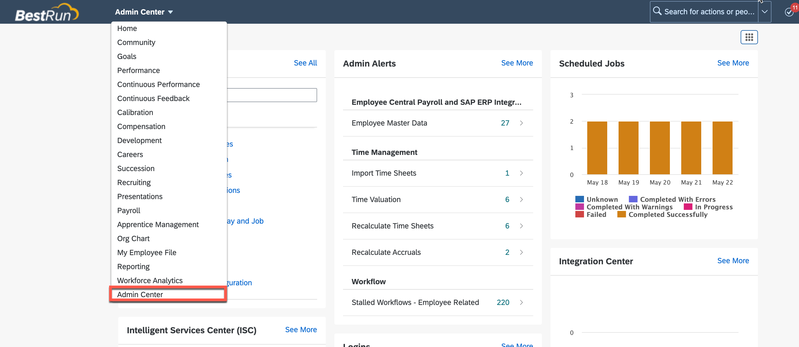

# EmployeeLookup Service - Covid Check

# Introduction

Employee details from CovidApp certificate are matched against the HR System (Successfactors) for the logged in user and additional deatils like location, contract type, photo are fetched from SuccessFactors system using the SAP Graph API.


# SAP Graph

SAP Graph is the new unified and consolidated API for SAP-managed data. Developers can use SAP Graph to build applications that access a connected business data graph of SAP-managed data, regardless of where this data resides.

With SAP Graph you navigate to and access the data you need, regardless of where this data resides. SAP Graph abstracts the physical landscape and the details of the different product stacks and offers you a simple view of the SAP-managed data, which you can access through a single API, spanning all key use cases. SAP Graph accesses the data in the customer-configured landscape on your users’ behalf, technically acting as middleware. SAP Graph itself doesn’t store or cache any data.

Learn how to subscribe to SAP Graph and create conenction to SuccessFactors using Destination

# Prerequisites

1. SAP BTP Subaccount
   * sap-graph subscription
   * Authorization & Trust Management Service
   * SAP Business Application Studio 

2. SAP SuccessFactors

## Creating SAP Graph Service Instance

1. Login to SAP BTP cockpit and navigate to your subaccount in the Cloud Foundry environment.
2. Click on Services -> Instance and Subscriptions -> Create
3. Create a service instance of SAP Graph.

    
4. Click the three dots to the right of the created instance and click on "Create Service Key"
    
5. Enter any name for the service key and click on "Create".
6. <a name="servicekey" />Download and save the created credentials as a text file.
    

## Become a key user

1. Login to SAP BTP cockpit and navigate to your subaccount in the Cloud Foundry environment.
2. Select Security / Role Collections  from the left-side menu, and then click on the + symbol (New Role Collection).
3. Enter "SAP Graph key user" as name and Create.
4. Select the role collection you just created and click Edit.
5. Click inside the Role Name box and then select sap-graph in the Application Identifier
6. Check the SAP_Graph_Key_User role. Click Add.
    
7. Don’t forget to Save your changes.
8. Go back to the subaccount view, select Security / Users  from the left-side menu, select your username, then click on Assign Role Collection on the right-hand pane, check the SAP Graph key user role collection and confirm by clicking Assign Role Collection.

Done! You have specified the landscape to be used for SAP Graph and promoted yourself as SAP Graph key user.

## Establish Trust between BTP subaccount Destination Service and SuccessFactors tenant

1. Navigate to your SAP BTP subaccount.
2. From the left-side menu, choose Connectivity -> Destinations
3. Choose the Download Trust button and save locally the X.509 certificate that identifies this subaccount.

    
4. Login to SuccessFactors
5. Go to the Admin Center and search for "OAuth". Choose Manage OAuth2 Client Applications.
    

    
6. Press the Register Client Application button on the right. In the <Application Name> field, provide some arbitrary descriptive name for the client. For <Application URL>, enter the Cloud Foundry host of the application, followed by the subaccount GUID, for example cfapps.stagingaws.hanavlab.ondemand.com/17d146c3-bc6c-4424-8360-7d56ee73bd32. This information is available in the cloud cockpit under subaccount details.
7. In the field <X.509 Certificate>, paste the certificate that you downloaded in step 3 above.
    

## Create destination for SuccessFactors

1. Navigate to your SAP BTP subaccount.
2. From the left-side menu, choose Connectivity -> Destinations and click on "New Destination" button.

    URL: URL of the SuccessFactors OData API you want to consume.

    Authentication: OAuth2SAMLBearerAssertion

    Audience: www.successfactors.com

    Client Key: API Key of the OAuth client you created in SuccessFactors.

    Token Service URL: API endpoint URL for the SuccessFactors instance, followed by /oauth/token and the URL parameter company_id with the company ID, for example <https://apisalesdemo2.successfactors.eu/oauth/token?company_id=SFPART019820>.

3. Enter four additional properties:

    apiKey: the API Key of the OAuth client you created in SuccessFactors.
    authnContextClassRef: urn:oasis:names:tc:SAML:2.0:ac:classes:PreviousSession
    nameIdFormat: urn:oasis:names:tc:SAML:1.1:nameid-format:emailAddress
                  if the user e-mail will be propagated to SuccessFactors
                  (or)
                  urn:oasis:names:tc:SAML:1.1:nameid-format:unspecified 
                  if the user ID will be propagated to a SuccessFactors application
    userIdSource: email

    

## Get ready for SAP Business Application Studio 

1.	Make sure you have opened your *SAP BTP Account* and navigate to your *subaccount*.
   
2.	Go to *Services* and select *Instances and Subscriptions*.
   
3.	Select **SAP Business Application Studio** located in the *Subscriptions* tab and click on the icon to open the application.
   

4. Create a **Dev Space** once the SAP Business Application Studio home appears.
   

5.	Enter a **Dev Space name** e.g 'CovidApp', select the type *Full Stack Cloud Application*.
   Don´t forget to click on the button *Create Dev Space*.
   
    
6.	Your Dev Space is now being created. As soon as the Dev Space is running you can click on your Dev Space name to  access it.

## Construct an SAP Graph - Business Data Graph

1. Open a new Terminal in the SAP Business Application Studio.
   

2. Execute the following command to install the SAP Graph configuration tool (graphctl). 
   ```bash
    npm i -g @sap/graph-toolkit
   ```
        
3. To check that the installation was successful, execute the following command:
   ```bash
    graphctl -v
   ```
    

4. Upload the service key file, that you have created during the service instance creation of the SAP Graph service, to the **temp** directory of your SAP Business Application Studio Dev Space. ([Step 6 of Creating SAP Graph Service Instance](#servicekey)) First, open a new folder in your workspace: 
    
    

    Selec the **tmp** directory. 

    

    Right-Click into the lower section to open the context-menu. Select **Upload File** and select the file that you have downloaded earlier. 

        

    The file that you have selected should now appear in the file list that you have previously right-clicked in. 
    

    > **IMPORTANT:** Do not commit this file to your GitHub repository and directly add it to your .gitignore file. Otherwise others can get access to the service credentials. 


5. Log into the SAP Graph configuration tool by providing the credentials text file that you upload previously as a parameter to the login command. 

    ```bash
    graphctl login -f <credentials file> 
    ````

6. A browser tab or window will open and require you to log in. Upon successful authentication you will see: 
    

7. Generate the SAP Graph configuration file by executing the below command:
   ```bash
    graphctl generate config -f <config.json>
    ```
    

8. Activate the configuration of the business data graph by executing the following command:
    ```bash
    graphctl activate config -f <config.json> 
    ```
    

    Once it is activated, you will see the message **Successfully activated business data graph**:

# Deployment

Now it's time to deploy the actual microservice that leverages the SAP Graph service and its API. The microservice itself is just a plain Node.js application calling the HTTP endpoint of the SAP Graph service. The deployment happens as an Multi-Target Application (MTA). 

1. Go to **Open Workspace** and select **projects**.
   

2. Clone the whole repository to get all the source code in order to build & deploy this and other artefacts: 
    ```bash
    git clone https://github.tools.sap/btp-use-case-factory/covidcheck/
    ```

3. Navigate to "employeeLookupService" directory in the terminal
    ```bash
    cd covidcheck/employeeLookupService/
    ```

4. Trigger the build of the Multi-Target Application (MTA): 
    ```bash
    mbt build
    ``` 

5. Once the build process is done, you can go on to deploy the application to the SAP BTP, Cloud Foundry Runtime using the *Cloud Foundry CLI*: 
    ```bash
    cf deploy ./mta_archives/employeeLookupService_1.0.0.mtar
    ```

    > You may need to log in using to your Cloud Foundry space using `cf login` before. 


