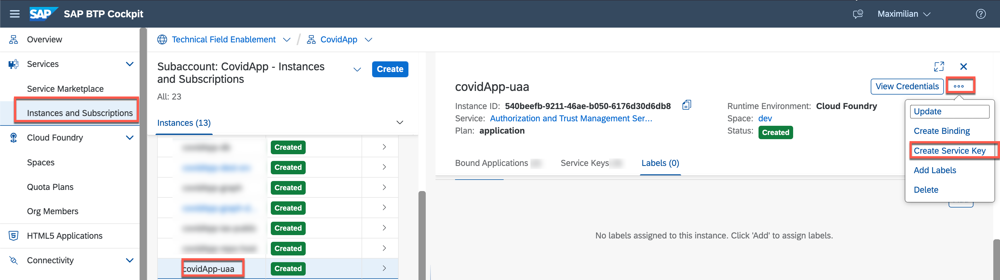
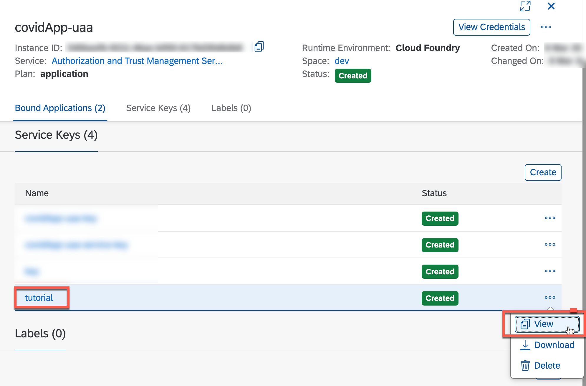
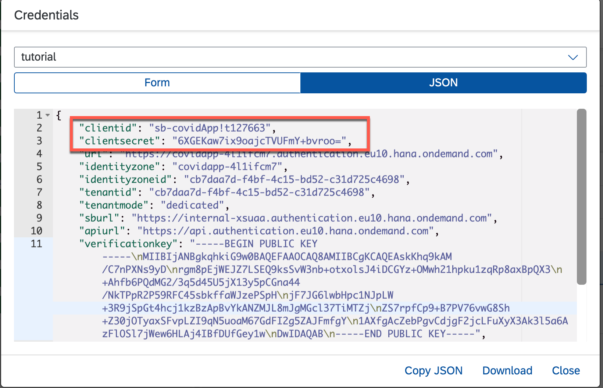
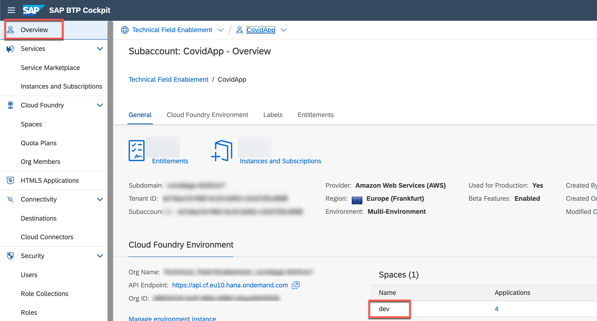
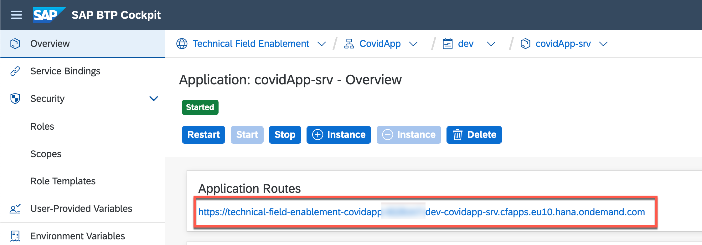
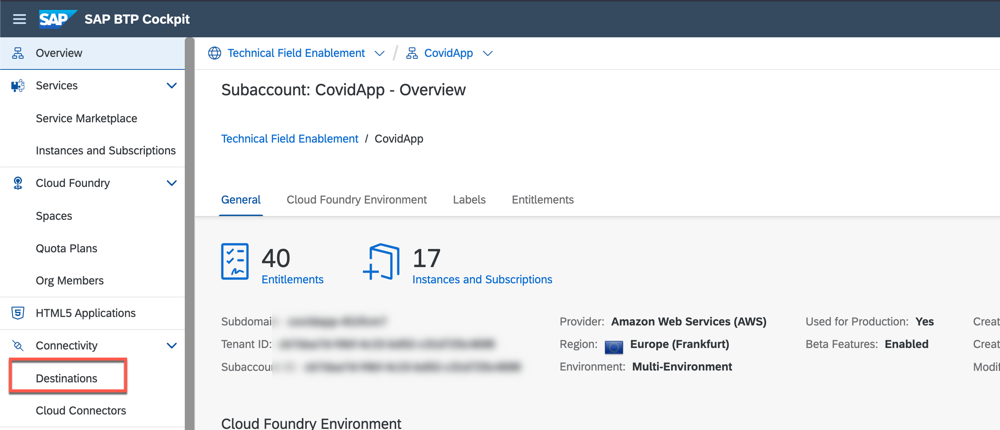
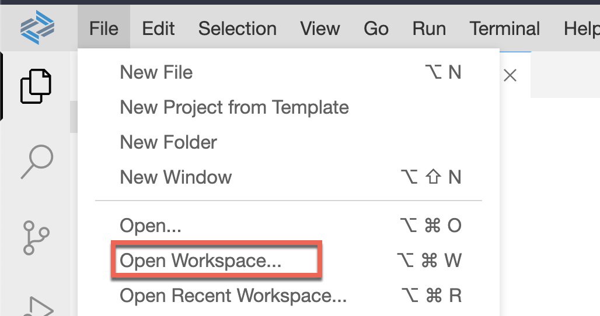
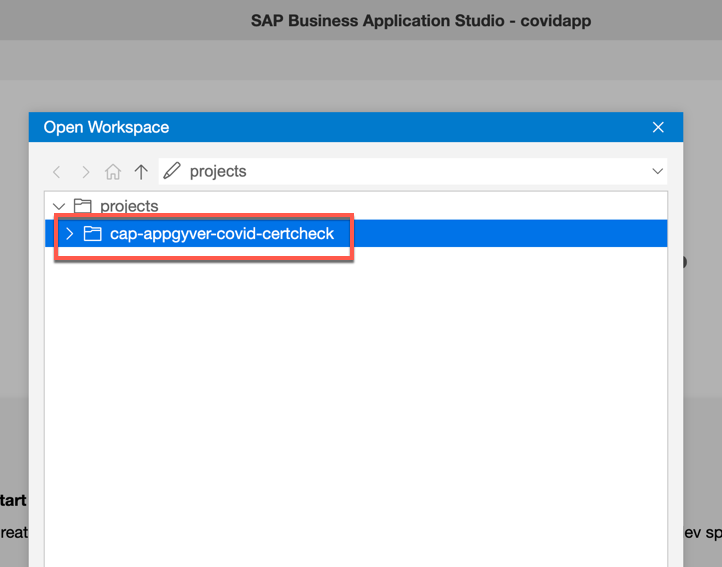

1. Create Destinations
2. Subscribe to SAP Business Application Studio
3. Clone repository
4. Build 
5. Deploy 

# CAP Application - Covid Check

# Introduction

In this step you will deploy the backend application that processes the Covid certificate (either as QR code or decoded string) of the SAP AppGyver application. This certificate is first technically validated; then it is checked how long the test/recovery/vaccination is valid. 

In addition, the applications connect to the microservice provided in the previous step, which reads further employee data and makes it available in a SAP Fiori Elements application. 

# Create Destination for EmployeeLookupService

1. Before we can actually create the Destination for the EmployeeLookupService, that you have previously deployed, you need create a service key for the **Authorization and Trust Management Service (xsuaa)** instance (namely **covidApp-uaa**). First, go to the [SAP BTP Cockpit](https://cockpit.eu10.hana.ondemand.com/cockpit/) and navigate to the subaccount you have used in the previous steps. 

2. Go to **Instances and Subscriptions**. 
   
3. Select the **covidApp-uaa** service instance followed by **Create Service Key**. 
    

4. Enter a **name** for the service key and continue with **Create**.

    > You can also use the Cloud Foundry CLI in the SAP Business Application Studio (or on your machine) to create a service key: `cf create-service-key covidApp-uaa tutorial`. 
   
5. After the service key has been successfully created, it should appear in the list of service keys for this service instance. Use **View** in the corresponding line to display the details. 
    

    > You can also use the Cloud Foundry CLI in the SAP Business Application Studio (or on your machine) to display the service key: `cf service-key covidApp-uaa tutorial`. 

6. Note down the following values that you will need to use/lookup again once you want to create the Destination in SAP BTP. 
   - **clientid**
   - **clientsecret**
   - **uaadomain**
    

7. Also, go to your subaccount **overview** and navigate to the Cloud Foundry space. 
    

8. Select the **emp-lookup-service** app and note down the **Application Route** for the Destination creation in SAP BTP. 
    

9.  Open the **Destinations** menu.
    

10. Create a **new Destination** with the following configuration using the values you have noted down in the previous steps:

| Attribute              |                    Value                    |                                     Example                                     |
| ---------------------- | :-----------------------------------------: | :-----------------------------------------------------------------------------: |
| Name                   |               EmployeeLookup                |                                                                                 |
| Type                   |                    HTTP                     |                                                                                 |
| URL                    | `<Application Route of emp-lookup-service>` |        **https://emp-lookup-service-dev.cfapps.eu10.hana.ondemand.com**         |
| ProxyType              |                  Internet                   |                                                                                 |
| Authentication         |               OAuth2JWTBearer               |                                                                                 |
| Client ID              |     `<clientid from the env variables>`     |                             **sb-covidApp!t123456**                             |
| Client Secret          |   `<clientsecret from the env variables>`   |                        **4YABCaw7ix9oajcTVUFmY+bvroo=**                         |
| Token Service URL Type |                  Dedicated                  |                                                                                 |
| Token Service URL      |   https:// + `uaadomain`  + /oauth/token    | **https://covidapp-4l1ifcm7.authentication.eu10.hana.ondemand.com/oauth/token** |
                   
> IMPORTANT: The name for the Destination needs to be exactly `EmployeeLookup` since the CAP application is explicitly looking for a destination with that particular name. 

# Deployment of the CAP application 

1. Go back to your Dev Space in the **SAP Business Application Studio** that you have already used to deploy the *EmployeeLookupService*. 

2. Open the already cloned GitHub repository (TODO: replace internal Link) via **Open Workspace**. 
    
    

3. Open a **New Terminal** and change into the directory for the CAP application, namely **covidApp**:
    ```bash
    cd covidApp
    ```

4. Trigger the build process for the Multi-Target Application (MTA) archive:
    ```bash
    mbt build
    ```

5. Deploy the application to the SAP BTP, Cloud Foundry runtime using: 
    ```
    cf deploy mta_archives/covidApp_1.0.9.mtar 
    ```

    > You may need to log in using to your Cloud Foundry space using `cf login` before. 

6. Check the log output of the previous step. Also `cf apps` will give you an indicator whether the app was succesfully deployed or not. `cf logs covidApp-srv --recent` will give you some more insights if starting the app has failed. 

---

Congratulations. You should now have a CAP app deployed in SAP BTP, Cloud Foundry runtime, utilizing the the EmployeeLookupService and some OpenSource packages to validate and verifiy Covid Certificates. The application receives requests from an SAP AppGyver app that is described in the following step. 
