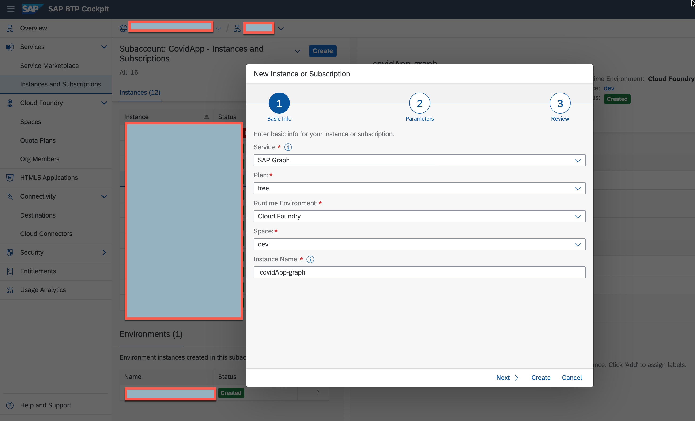
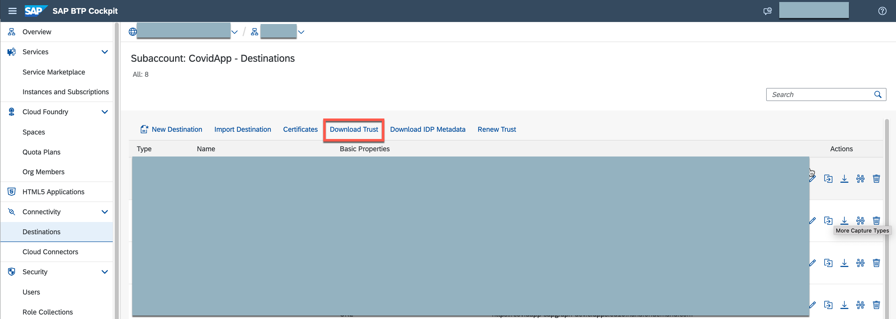
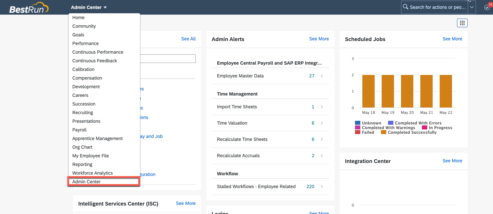
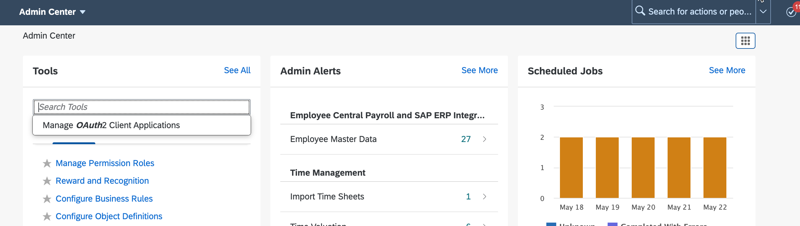
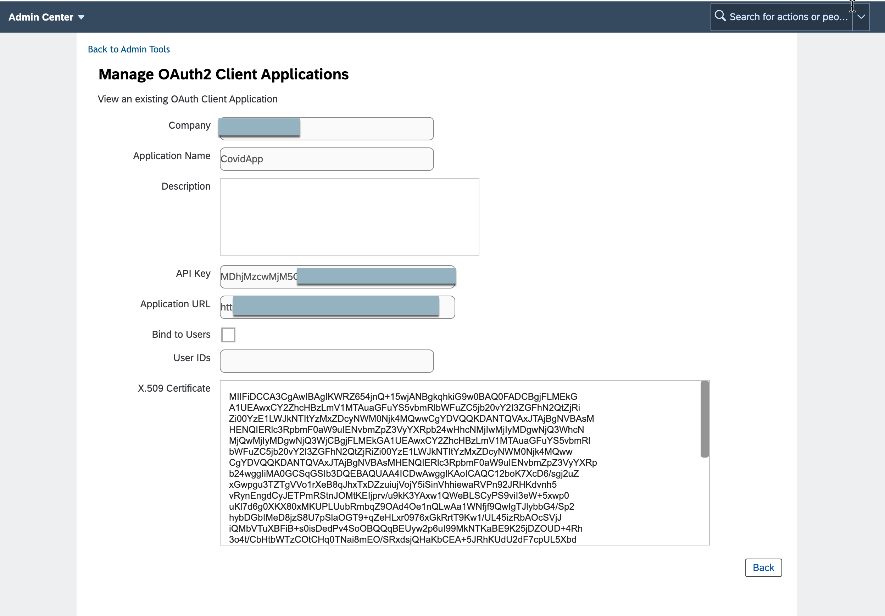
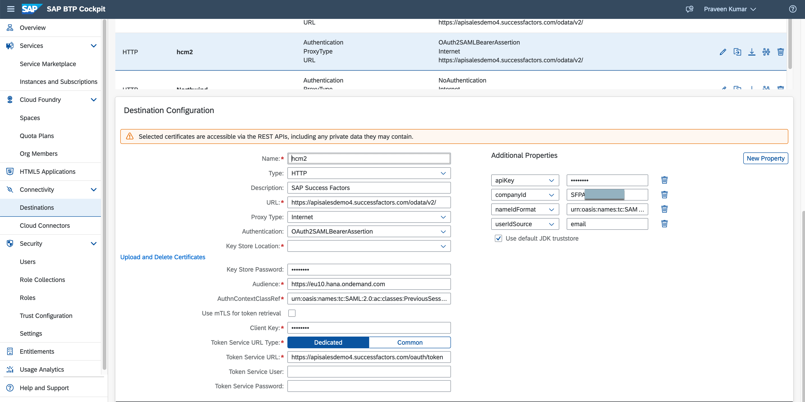

# EmployeeLookup Service - Covid Check

# Introduction

Employee details from CovidApp certificate are matched against the HR System (Successfactors) for the logged in user and additional deatils like location, contract type, photo are fetched from SuccessFactors system using the SAP Graph API.

# SAP Graph

SAP Graph is the new unified and consolidated API for SAP-managed data. Developers can use SAP Graph to build applications that access a connected business data graph of SAP-managed data, regardless of where this data resides.

With SAP Graph you navigate to and access the data you need, regardless of where this data resides. SAP Graph abstracts the physical landscape and the details of the different product stacks and offers you a simple view of the SAP-managed data, which you can access through a single API, spanning all key use cases. SAP Graph accesses the data in the customer-configured landscape on your users’ behalf, technically acting as middleware. SAP Graph itself doesn’t store or cache any data.

Learn how to subscribe to SAP Graph and create conenction to SuccessFactors using Destination

# Prerequisites

1. SAP BTP Subaccount
    (i) sap-graph subscription
    (ii) Authorization & Trust Management Service
2. SAP SuccessFactors

## Creating SAP Graph Service Instance

1. Login to SAP BTP cockpit and navigate to your subaccount in the Cloud Foundry environment.
2. Click on Services -> Instance and Subscriptions -> Create
3. Create a service instance of SAP Graph.

    

## Establish Trust between BTP subaccount Destination Service and SuccessFactors tenant

1. Navigate to your SAP BTP subaccount.
2. From the left-side menu, choose Connectivity -> Destinations
3. Choose the Download Trust button and save locally the X.509 certificate that identifies this subaccount.

    
4. Login to SuccessFactors
5. Go to the Admin Center and search for "OAuth". Choose Manage OAuth2 Client Applications.
    

    
6. Press the Register Client Application button on the right. In the <Application Name> field, provide some arbitrary descriptive name for the client. For <Application URL>, enter the Cloud Foundry host of the application, followed by the subaccount GUID, for example cfapps.stagingaws.hanavlab.ondemand.com/17d146c3-bc6c-4424-8360-7d56ee73bd32. This information is available in the cloud cockpit under subaccount details.
7. In the field <X.509 Certificate>, paste the certificate that you downloaded in step 3 above.
    

# Create destination for SuccessFactors

1. Navigate to your SAP BTP subaccount.
2. From the left-side menu, choose Connectivity -> Destinations and click on "New Destination" button.

    URL: URL of the SuccessFactors OData API you want to consume.

    Authentication: OAuth2SAMLBearerAssertion

    Audience: www.successfactors.com

    Client Key: API Key of the OAuth client you created in SuccessFactors.

    Token Service URL: API endpoint URL for the SuccessFactors instance, followed by /oauth/token and the URL parameter company_id with the company ID, for example <https://apisalesdemo2.successfactors.eu/oauth/token?company_id=SFPART019820>.

3. Enter four additional properties:

    apiKey: the API Key of the OAuth client you created in SuccessFactors.

    authnContextClassRef: urn:oasis:names:tc:SAML:2.0:ac:classes:PreviousSession

    nameIdFormat: urn:oasis:names:tc:SAML:1.1:nameid-format:emailAddress

    if the user ID will be propagated to a SuccessFactors application, or
    urn:oasis:names:tc:SAML:1.1:nameid-format:emailAddress, if the user e-mail will be propagated to SuccessFactors.

    userIdSource: email

    

4. Configure SAP graph to access SuccessFactors destination

# Deployment
EmployeeLookupService application is built as an MTA application.
1. Clone the github repo
    https://github.tools.sap/btp-use-case-factory/covidcheck/
2. Open it in your IDE like SAP Business Application Studio or MS Visual Studio code
3. Navigate to "employeeLookupService" folder in the Terminal
4. Execute the command "mbt build -p=cf" to build the app
5. To deploy "cf deploy ./mta_archives/employeeLookupService_1.0.0.mtar"

