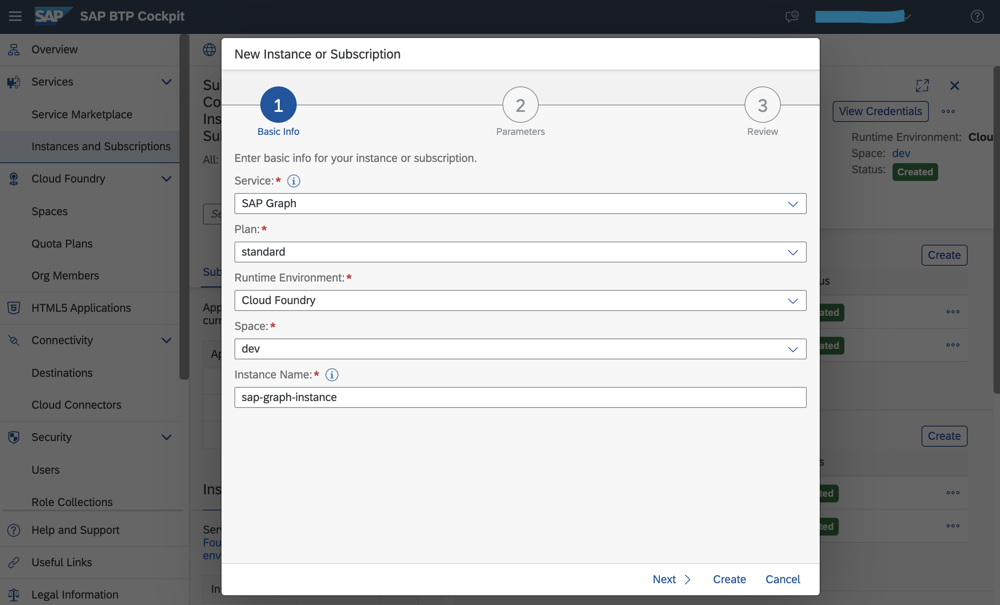

# Graph Application - Covid Check

# Introduction
Employee details from CovidApp certificate are matched against the HR System (Successfactors) for the logged in user and additional deatils like location, contract type, photo are fetched from SuccessFactors system using the SAP Graph API.

# SAP Graph
SAP Graph is the new unified and consolidated API for SAP-managed data. Developers can use SAP Graph to build applications that access a connected business data graph of SAP-managed data, regardless of where this data resides.

With SAP Graph you navigate to and access the data you need, regardless of where this data resides. SAP Graph abstracts the physical landscape and the details of the different product stacks and offers you a simple view of the SAP-managed data, which you can access through a single API, spanning all key use cases. SAP Graph accesses the data in the customer-configured landscape on your users’ behalf, technically acting as middleware. SAP Graph itself doesn’t store or cache any data.

Learn how to subscribe to SAP Graph and create conenction to SuccessFactors using Destination

1. Go to your SAP BTP Subaccount and create a service instance of SAP Graph.
    
    
    
2. Establish Trust between BTP subaccount and Successfactors
3. Create destination for Successfactors
4. Configure SAP graph to access Successfactors destination

