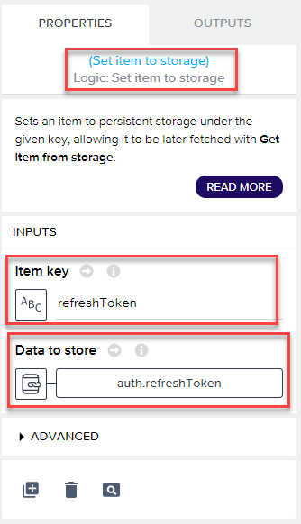
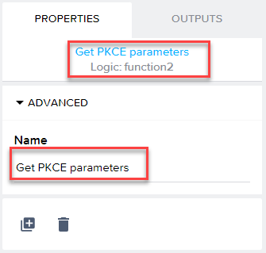
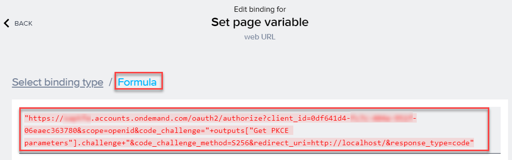
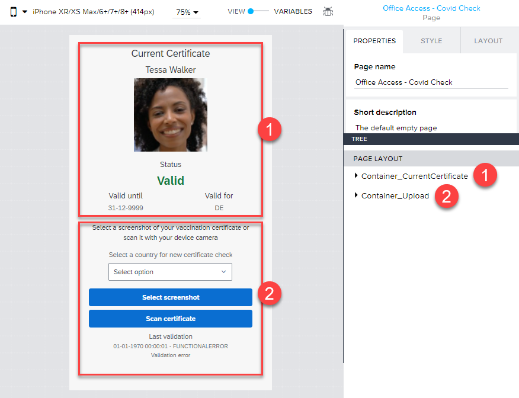

# AppGyver App Office Access - Covid Check 

## Introduction

Learn how to configure a new AppGyver app that allows you to upload screenshots or scans of Covid vacination certificates to your SAP CAP OData service. After successfull validation of the certificate, the app will display the validity date and status retreived by your service. 

### Create a new AppGyver app

1. Go to your SAP BTP Subaccount and subscribe to the SAP AppGyver service offering. 

2. Open SAP AppGyver from your Subaccount. 

    

3. Create a new SAP App Gyver project and call it e.g. **CovidChecker**.

### Enable authentication 

1. Switch to the **Auth** tab of your project and add Authentication. 
    

2. Follow the screenshot details. 
    

3. Follow the screenshot details. 
    

4. Once Authentication is activated, you will see that the **Log In** page is loaded for authentication as it is defined as **Initial View**. 
    

5. Change the name of the initial view by switching to the page editor and selecting the **Log In** page. Change the page name to **OAuth**. Save your changes of required. 
    

6. Remove the default content of the **Log In** page and then open the **Component Marketplace** to add a new component. 
    

7. Follow the screenshot details to add the **WebView** component. 
    

8. Follow the screenshot details.  
    

9. Drop a new WebView component to the canvas.   
    

10. Save your changes and switch back to the **Auth** tab of your project. You will see that the name of the initial view has changed as you've changed the name of your page.   
    

### Setup your navigation

1. Before you setup the navigation, rename the initial **Empty page** which was created by SAP AppGyver automatically. Therefore switch to the page overview and select the Empty page. 
    

2. Change the page name to **Office Access - Covid Check** and save your changes. 

    

3. Switch to the **Navigation** tab and modify the existing **Built-In Navigation**. Change the **icon** and **tab name** of the existing page as displayed in the screenshots. 
    

    >Hint: The icon used in this tutorial can be found by searching for **superpowers** in the icon library. 
    

### Apply the SAP Fiori theme

Apply the SAP Fiori theme to your your project in the **Theme** tab of SAP AppGyver. Details can be found in the screenshot. 

### Add variables to your app

Your SAP AppGyver app will need a variety of variables to store information like access tokens or business data. 

1. To add these variables, first open the **Office Access - Covid Check** page and change the toggle in the top right from **View** to **Variables**. Start adding the reuqired **App Variables** as you can see in the screenshots. 
    
    
    

2. Create two **page variables** required for the current page as you can see in the following screenshot. 
    

3. Save your changes and switch to the **OAuth** page which requires some more **page variables**. Create them as visible in the screenshot and save your changes again. 
    

### Create your login view

1. Open the **OAuth** page and follow the screenshot details.  
    

2. Modify the general page settings as visible in the following screenshots. 

    
    

3. Modify the WebView component settings as visible in the following screenshots.
    >**Hint**: A preview value does not need to be set!

    
    
    
    
### Create your login view logic

1. Being on the **OAuth** page, open the SAP AppGyver logic section in the bottom of the screen. This is where you will configure the logic applied when the OAuth page is loaded. 

2. Please add the following components to your logic flow and connect them as depicted, before you start with the individual component configurations. 
    

    | #  |     Type     |       Feature         |
    |----|:------------:|----------------------:|
    | 1  | Event        | Page mounted          |
    | 2  | View         | Hide spinner          |
    | 3  | Storage      | Get item from storage |
    | 4  | Utility      | If condition          |
    | 5  | Storage      | Get item from storage |
    | 6  | Variables    | Set app variable      |
    | 7  | Data         | HTTP request          |
    | 8  | Variables    | Set app variable      |
    | 9  | Storage      | Set item to storage   |
    | 10 | Storage      | Set item to storage   |
    | 11 | Navigation   | Dismiss initial view  |
    | 12 | JS           | Java Script           |
    | 13 | Variables    | Set page variable     |
    | 14 | Variables    | Set page variable     |

    >#1 Event - Page mounted  
    >

    >#2 View - Hide spinner  
    >

    >#3 Storage - Get item from storage  
    >

    >#4 Utility - If condition  
    >
    >

    >#5 Storage - Get item from storage  
    >

    >#6 Variables - Set app variable  
    >
    >
    >

    >#7 Data - HTTP request  
    >
    >
    >
    >

    >#8 Variables - Set app variable  
    >
    >
    >
    >
    >
    >
    >

    >#9 Storage - Set item to storage  
    >
    >

    >#10 Storage - Set item to storage  
    >
    >

    >#11 Navigation - Dismiss initial view  
    >

    >#12 JS - Java Script  
    >
    >
    >
    >

    >#13 Variables - Set page variable  
    >
    >
    >

    >#14 Variables - Set page variable  
    >
    >
    >

### Create your Office Access - Covid Check view logic flow

1. Being on the **Office Access - Covid Check** page, open the SAP AppGyver logic section in the bottom of the screen. This is where you will configure the logic applied when the content page is loaded. 

2. Please add the following components to your logic flow and connect them as depicted, before you start with the individual component configurations. 
    

    | #  |     Type     |       Feature         |
    |----|:------------:|----------------------:|
    | 1  | Event        | Page mounted          |
    | 2  | Storage      | Get item from storage |
    | 3  | Variables    | Set app variable      |
    | 4  | Storage      | Get item from storage |
    | 5  | Variables    | Set app variable      |
    | 6  | Data         | HTTP request          |
    | 7  | Variables    | Set page variable     |
    | 8  | View         | Hide spinner          |

    >#1 Event - Page mounted  
    >

    >#2 Storage - Get item from storage  
    >

    >#3 Variables - Set app variable  
    >
    >
    >
    >
    >
    >
    >

    >#4 Storage - Get item from storage  
    >

    >#5 Variables - Set app variable  
    >
    >
    >
    >
    >
    >

    >#6 Data - HTTP request  
    >
    >
    >
    >

    >#7 Variables - Set page variable  
    >
    >
    >

    >#8 View - hide spinner  
    >

### Create your Office Access - Covid Check view

1. Being on the **Office Access - Covid Check** page, open the view design canvas. This is where you will configure the logic applied when the content page is loaded. 

2. Please add two containers to your canvas. 
    

    >#1 Container - Certificate  
    >
    >
    >
    

    >#2 Container - Upload  
    >
    >

3. Please add the following components to your view design canvas and set the individual component configurations. Not all items (e.g. plain text fields) are described in detail. 
    
    

    >#1 Title  
    >
    >

    >#2 Title  
    >
    >

    >#3 Image  
    >
    >
    >
    >
    >

    >#4 Text  
    >
    >
    >
    >
    >
    
    >#5 Text  
    >

    

### Launch your app

You can launch your app initially from the **Launch** tab. Therefore we recommend to use the SAP AppGyver app which is available in the Google or Apple app stores. Just scan the QR code and the app will start on your device. 

### Setup your navigation

